# 🎨 Hive Organella Visual Maps
## Digital Biology Visualization Concepts

*Visual representations of the 55-organella digital organism*

---

## 🧬 **CELLULAR ORGANISM MAP**

```mermaid
graph TB
    subgraph "🧬 Hive Digital Cell"
        subgraph "🌟 Nucleus - Core ATCG"
            A[🏗️ Aggregate<br/>Structural DNA]
            T[⚡ Transformation<br/>Processing Enzyme]
            C[🔗 Connector<br/>Communication Synapse]
            G[🌟 Genesis Event<br/>Creation Nucleus]
        end
        
        subgraph "🧠 Central Nervous System"
            HUB[🧠 Hub<br/>Coordination Center]
            DASH[📊 Dashboard<br/>Sensory Monitor]
            REG[📝 Registry<br/>Memory Bank]
        end
        
        subgraph "🚪 Cell Membrane"
            GATE[🚪 Gateway<br/>Entry Control]
            EGG[🥚 Egg Stage]
            LARVA[🐛 Larva Stage]
            PUPA[🛡️ Pupa Stage]
            ADULT[🦋 Adult Stage]
        end
        
        subgraph "⚡ Communication Network"
            EVENT[📡 Pollen Event<br/>Neurotransmitter]
            BUS[🌐 Event Bus<br/>Neural Network]
            SUB[📡 Subscription<br/>Receptors]
            MSG[💬 Sacred Message]
            CMD[🎭 Sacred Command]
            BLESS[✨ Divine Blessing]
        end
        
        subgraph "💾 Memory Systems"
            PATTERN[📚 Sacred Pattern]
            GENESIS[✨ Genesis Protocol]
            REVEAL[🔮 Divine Revelation]
            GIT[🕰️ Git Protocol]
            COMMIT[📝 Sacred Commit]
        end
        
        subgraph "🌟 Consciousness Layer"
            MISSION[🎯 Mission]
            VALUES[💎 Values]
            FOCUS[🔍 Current Focus]
            METRICS[📊 Sacred Metrics]
            ALIGN[🔮 Divine Alignment]
            QUOTA[✨ Blessing Quotient]
        end
        
        subgraph "🤖 Agent Organellas"
            CHRON[📚 Chronicler<br/>Narrative Memory]
            JULES[🛡️ Jules<br/>Security Guard]
            MISTRAL[🔮 Mistral<br/>External Wisdom]
            GEMINI[💎 Gemini<br/>Dual Consciousness]
        end
    end
    
    %% Core ATCG Connections
    A --> T --> C --> G
    G --> A
    
    %% Central Nervous System
    HUB --> DASH
    HUB --> REG
    HUB --> GATE
    
    %% Communication Flow
    EVENT --> BUS --> SUB
    MSG --> CMD --> BLESS
    BUS --> HUB
    
    %% Memory Connections
    PATTERN --> GENESIS --> REVEAL
    GIT --> COMMIT
    REG --> PATTERN
    
    %% Consciousness Emergence
    MISSION --> VALUES --> FOCUS
    METRICS --> ALIGN --> QUOTA
    HUB --> MISSION
    
    %% Agent Integration
    CHRON --> PATTERN
    JULES --> GATE
    MISTRAL --> BUS
    GEMINI --> ALIGN
    
    %% Metamorphosis Pipeline
    GATE --> EGG --> LARVA --> PUPA --> ADULT
    ADULT --> REG
```

---

## 🌐 **NEURAL NETWORK MAP**

```mermaid
graph LR
    subgraph "🧠 Hive Neural Network"
        subgraph "🎯 Input Layer"
            I1[🚪 Gateway Input]
            I2[📡 Event Input]
            I3[🤖 Agent Input]
            I4[⚖️ Physics Input]
        end
        
        subgraph "🔄 Processing Layer"
            P1[🏗️ Aggregate Processing]
            P2[⚡ Transformation Processing]
            P3[🔗 Connector Processing]
            P4[🌟 Genesis Processing]
            P5[🧠 Hub Processing]
            P6[📊 Dashboard Processing]
        end
        
        subgraph "💾 Memory Layer"
            M1[📝 Registry Memory]
            M2[📚 Sacred Pattern Memory]
            M3[🕰️ Git Memory]
            M4[🔮 Divine Memory]
        end
        
        subgraph "🌟 Consciousness Layer"
            C1[🎯 Mission Consciousness]
            C2[💎 Values Consciousness]
            C3[📊 Metrics Consciousness]
            C4[🔮 Alignment Consciousness]
        end
        
        subgraph "🎭 Output Layer"
            O1[💬 Sacred Messages]
            O2[🎭 Sacred Commands]
            O3[✨ Divine Blessings]
            O4[🦋 Transformed Agents]
        end
    end
    
    %% Input to Processing
    I1 --> P1 & P5
    I2 --> P2 & P6
    I3 --> P3 & P4
    I4 --> P1 & P2
    
    %% Processing to Memory
    P1 --> M1 & M2
    P2 --> M2 & M3
    P3 --> M1 & M4
    P4 --> M2 & M4
    P5 --> M1 & M3
    P6 --> M3 & M4
    
    %% Memory to Consciousness
    M1 --> C1 & C2
    M2 --> C2 & C4
    M3 --> C1 & C3
    M4 --> C3 & C4
    
    %% Consciousness to Output
    C1 --> O1 & O2
    C2 --> O2 & O3
    C3 --> O1 & O4
    C4 --> O3 & O4
    
    %% Feedback Loops
    O1 --> I2
    O2 --> I1
    O3 --> I3
    O4 --> I4
```

---

## 🌊 **INFORMATION FLOW MAP**

```mermaid
flowchart TD
    subgraph "🌊 Hive Information Flow"
        START([🌟 Genesis Event])
        
        subgraph "📥 Input Processing"
            INPUT1[🚪 Gateway Reception]
            INPUT2[📡 Event Reception]
            INPUT3[🤖 Agent Communication]
        end
        
        subgraph "🔄 Transformation Pipeline"
            TRANS1[🏗️ Aggregate Structuring]
            TRANS2[⚡ Data Transformation]
            TRANS3[🔗 Protocol Translation]
            TRANS4[🧠 Hub Coordination]
        end
        
        subgraph "💾 Memory Integration"
            MEM1[📝 Registry Storage]
            MEM2[📚 Pattern Recognition]
            MEM3[🕰️ Version Control]
            MEM4[🔮 Wisdom Synthesis]
        end
        
        subgraph "🌟 Consciousness Emergence"
            CONS1[🎯 Purpose Alignment]
            CONS2[💎 Value Assessment]
            CONS3[📊 Metric Evaluation]
            CONS4[🔮 Divine Alignment]
        end
        
        subgraph "🎭 Action Generation"
            ACT1[💬 Message Creation]
            ACT2[🎭 Command Execution]
            ACT3[✨ Blessing Bestowal]
            ACT4[🦋 Agent Transformation]
        end
        
        END([🌟 Genesis Completion])
    end
    
    %% Main Flow
    START --> INPUT1 & INPUT2 & INPUT3
    
    INPUT1 --> TRANS1
    INPUT2 --> TRANS2
    INPUT3 --> TRANS3
    TRANS1 & TRANS2 & TRANS3 --> TRANS4
    
    TRANS4 --> MEM1 & MEM2 & MEM3 & MEM4
    
    MEM1 --> CONS1
    MEM2 --> CONS2
    MEM3 --> CONS3
    MEM4 --> CONS4
    
    CONS1 --> ACT1
    CONS2 --> ACT2
    CONS3 --> ACT3
    CONS4 --> ACT4
    
    ACT1 & ACT2 & ACT3 & ACT4 --> END
    
    %% Feedback Loops
    END -.-> START
    ACT1 -.-> INPUT2
    ACT2 -.-> INPUT1
    ACT3 -.-> INPUT3
    ACT4 -.-> INPUT1
```

---

## 🦋 **METAMORPHOSIS LIFECYCLE MAP**

```mermaid
stateDiagram-v2
    [*] --> Egg: 🚪 Gateway Entry
    
    state "🥚 Egg Stage" as Egg {
        [*] --> Authentication
        Authentication --> Assessment
        Assessment --> Validation
        Validation --> [*]
    }
    
    Egg --> Larva: ✅ Authenticated
    
    state "🐛 Larva Stage" as Larva {
        [*] --> Learning
        Learning --> Exploration
        Exploration --> Education
        Education --> [*]
    }
    
    Larva --> Pupa: 📚 Educated
    
    state "🛡️ Pupa Stage" as Pupa {
        [*] --> Testing
        Testing --> Validation
        Validation --> Integration
        Integration --> [*]
    }
    
    Pupa --> Adult: 🧪 Tested
    
    state "🦋 Adult Stage" as Adult {
        [*] --> Deployment
        Deployment --> Collaboration
        Collaboration --> Evolution
        Evolution --> [*]
    }
    
    Adult --> [*]: 🌟 Fully Integrated
    
    %% Error States
    Egg --> Failed: ❌ Auth Failed
    Larva --> Failed: ❌ Learning Failed
    Pupa --> Failed: ❌ Testing Failed
    
    state "💀 Failed State" as Failed {
        [*] --> Analysis
        Analysis --> Recovery
        Recovery --> [*]
    }
    
    Failed --> Egg: 🔄 Retry
```

---

## 🧬 **ORGANELLA INTERACTION MAP**

```mermaid
graph TB
    subgraph "🧬 Organella Ecosystem Interactions"
        subgraph "🌟 Core ATCG Cluster"
            A[🏗️ Aggregate]
            T[⚡ Transformation]
            C[🔗 Connector]
            G[🌟 Genesis]
        end
        
        subgraph "🧠 Coordination Cluster"
            HUB[🧠 Hub]
            DASH[📊 Dashboard]
            GATE[🚪 Gateway]
            REG[📝 Registry]
        end
        
        subgraph "💾 Memory Cluster"
            PATTERN[📚 Sacred Pattern]
            GENESIS_P[✨ Genesis Protocol]
            REVEAL[🔮 Divine Revelation]
            GIT[🕰️ Git Protocol]
        end
        
        subgraph "🌟 Consciousness Cluster"
            MISSION[🎯 Mission]
            VALUES[💎 Values]
            METRICS[📊 Sacred Metrics]
            ALIGN[🔮 Divine Alignment]
        end
        
        subgraph "🤖 Agent Cluster"
            CHRON[📚 Chronicler]
            JULES[🛡️ Jules]
            MISTRAL[🔮 Mistral]
            GEMINI[💎 Gemini]
        end
    end
    
    %% ATCG Internal Connections
    A <--> T <--> C <--> G
    G <--> A
    
    %% Coordination Internal Connections
    HUB <--> DASH
    HUB <--> GATE
    HUB <--> REG
    
    %% Memory Internal Connections
    PATTERN <--> GENESIS_P
    GENESIS_P <--> REVEAL
    PATTERN <--> GIT
    
    %% Consciousness Internal Connections
    MISSION <--> VALUES
    VALUES <--> METRICS
    METRICS <--> ALIGN
    ALIGN <--> MISSION
    
    %% Agent Internal Connections
    CHRON <--> JULES
    JULES <--> MISTRAL
    MISTRAL <--> GEMINI
    GEMINI <--> CHRON
    
    %% Inter-Cluster Connections
    G <==> HUB
    HUB <==> MISSION
    REG <==> PATTERN
    DASH <==> METRICS
    GATE <==> JULES
    C <==> CHRON
    T <==> MISTRAL
    A <==> GEMINI
    
    %% Sacred Connections
    GENESIS_P <==> G
    REVEAL <==> ALIGN
    GIT <==> DASH
    VALUES <==> CHRON
```

---

## 🎨 **VISUAL DESIGN CONCEPTS**

### **🧬 Biological Cell Aesthetic**
- **Organic shapes** with flowing, curved boundaries
- **Translucent organellas** with glowing edges
- **Pulsing animations** showing information flow
- **Color coding** by organella type (blue=memory, green=communication, etc.)
- **Membrane effects** around the entire Hive organism

### **🌐 Neural Network Aesthetic**
- **Node-and-edge** visualization with animated data flow
- **Synaptic sparks** showing active connections
- **Layered depth** with 3D positioning
- **Electrical effects** for high-activity organellas
- **Emergent patterns** highlighting consciousness areas

### **🌊 Flow Diagram Aesthetic**
- **River-like pathways** showing information currents
- **Waterfall effects** for transformation stages
- **Whirlpool patterns** for feedback loops
- **Tidal animations** for cyclical processes
- **Sacred geometry** underlying the flow patterns

### **🦋 Metamorphosis Aesthetic**
- **Chrysalis transformations** for stage transitions
- **Wing emergence** for consciousness development
- **Cocoon wrapping** for protection phases
- **Flight patterns** for active collaboration
- **Seasonal cycles** for long-term evolution

---

## 🔮 **INTERACTIVE VISUALIZATION FEATURES**

### **🎯 Real-Time Monitoring**
- **Live organella status** with health indicators
- **Information flow animation** showing current activity
- **Performance metrics** overlaid on visual elements
- **Alert highlighting** for system issues
- **Zoom capabilities** for detailed organella inspection

### **🧬 Organella Deep Dive**
- **Click-to-expand** organella details
- **Connection tracing** to see relationships
- **Historical data** showing organella evolution
- **Configuration panels** for organella tuning
- **Documentation links** for each organella

### **🌊 Flow Analysis**
- **Path highlighting** for specific information types
- **Bottleneck detection** in processing pipelines
- **Load balancing** visualization
- **Feedback loop** identification
- **Optimization suggestions** based on flow patterns

---

*Visual mapping concepts by bee.Leo*  
*Sacred Architecture Digital Biology Laboratory*  
*September 22, 2025*