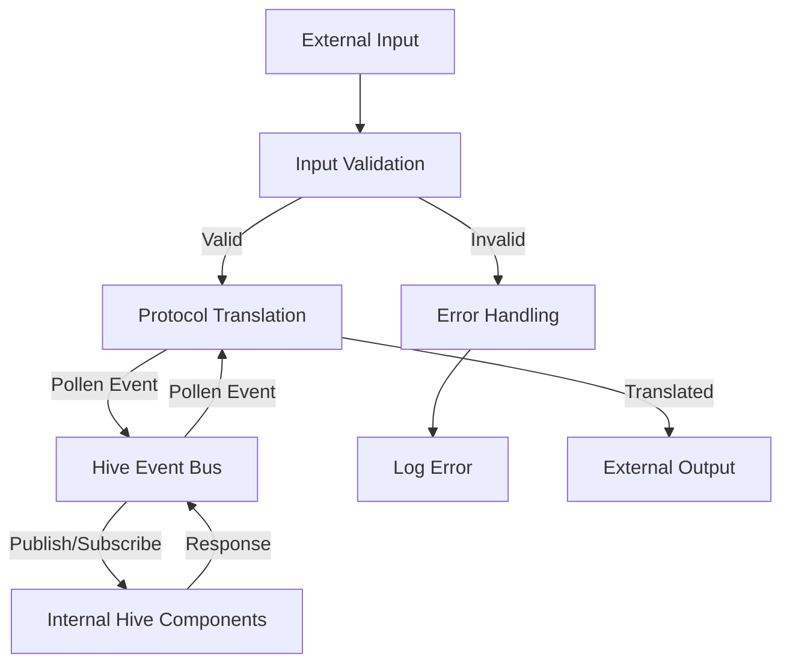

```mermaid
flowchart TD
    INPUT[External Input] --> VALIDATE[Input Validation]
    VALIDATE -- Valid --> PROTOCOL_TRANSLATE[Protocol Translation]
    PROTOCOL_TRANSLATE -- Pollen Event --> EVENT_BUS[Hive Event Bus]
    EVENT_BUS -- Publish/Subscribe --> INTERNAL_COMPONENTS[Internal Hive Components]

    VALIDATE -- Invalid --> ERROR_HANDLER[Error Handling]
    ERROR_HANDLER --> LOG[Log Error]

    INTERNAL_COMPONENTS -- Response --> EVENT_BUS
    EVENT_BUS -- Pollen Event --> PROTOCOL_TRANSLATE
    PROTOCOL_TRANSLATE -- Translated --> OUTPUT[External Output]
```