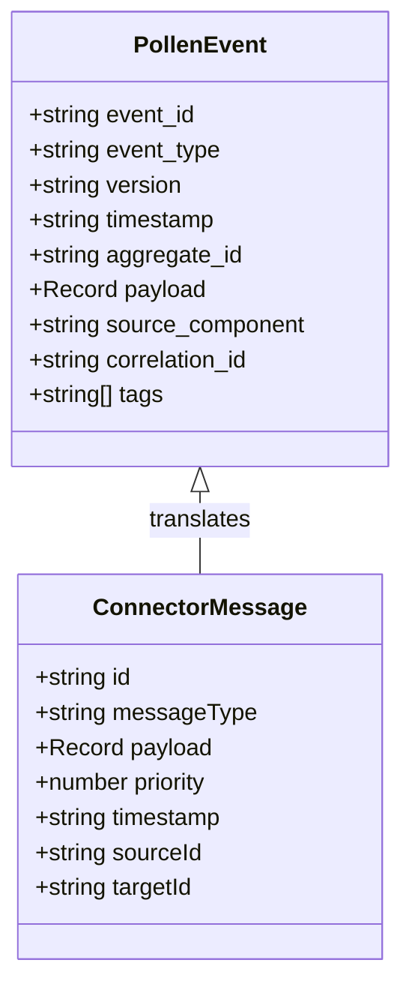

```mermaid
classDiagram
    class PollenEvent {
        +string event_id
        +string event_type
        +string version
        +string timestamp
        +string aggregate_id
        +Record<string, unknown> payload
        +string source_component
        +string correlation_id
        +string[] tags
    }

    class ConnectorMessage {
        +string id
        +string messageType
        +Record<string, unknown> payload
        +number priority
        +string timestamp
        +string sourceId
        +string targetId
    }

    PollenEvent <|-- ConnectorMessage : translates
```