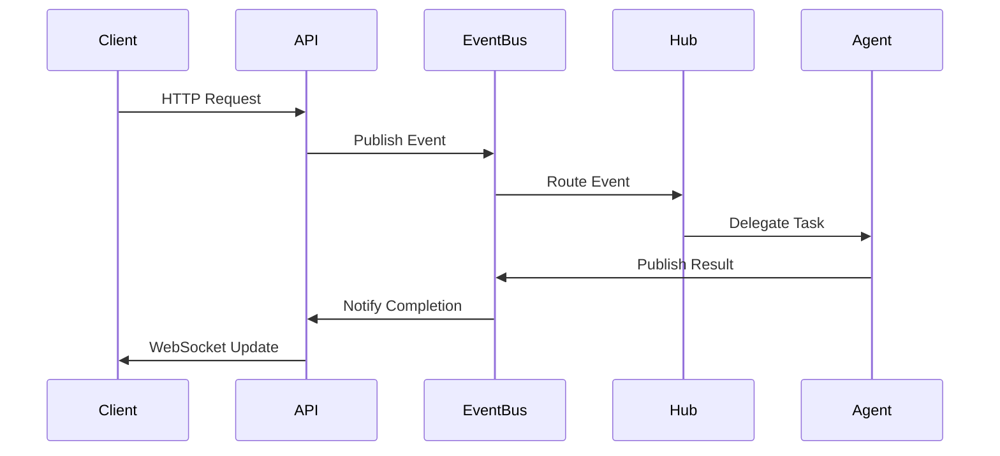
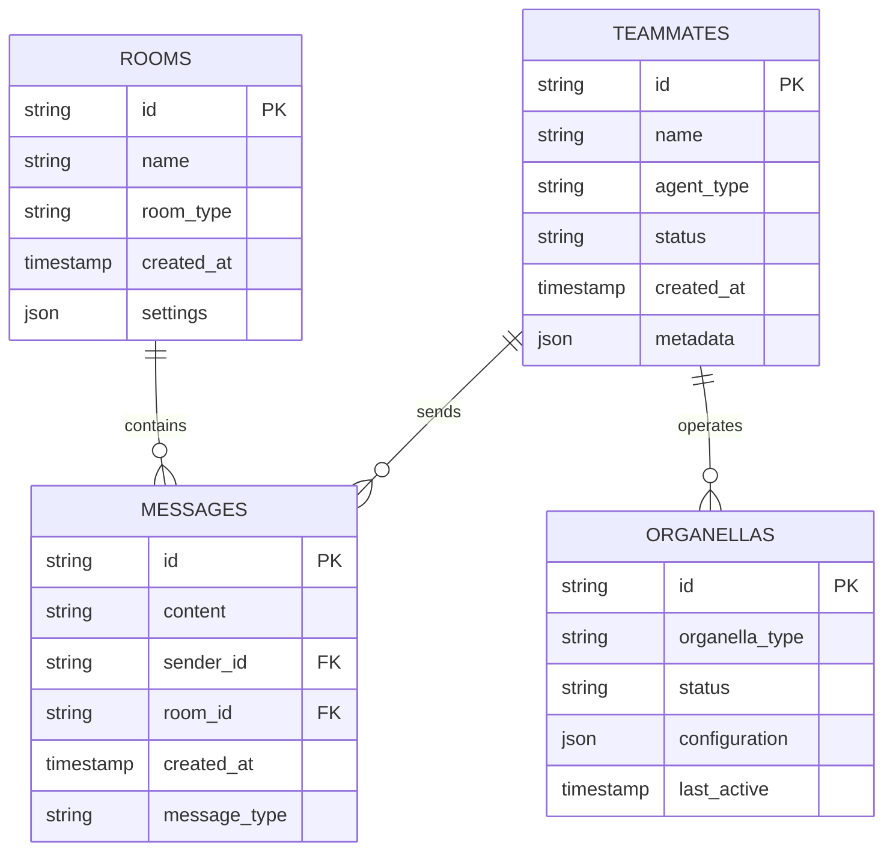
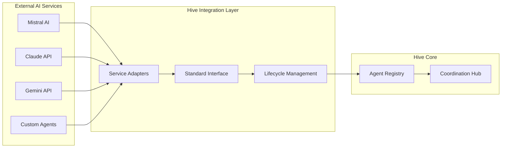
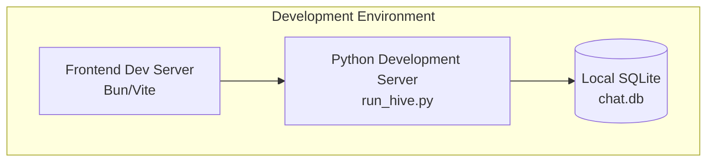
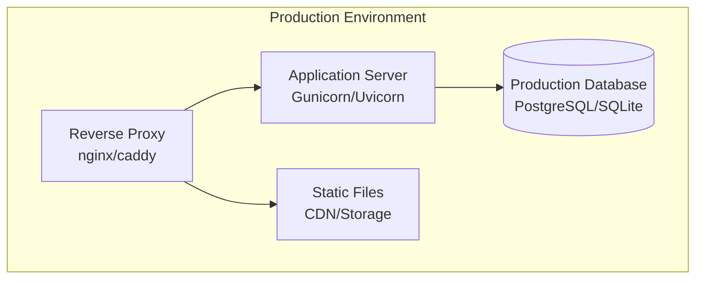
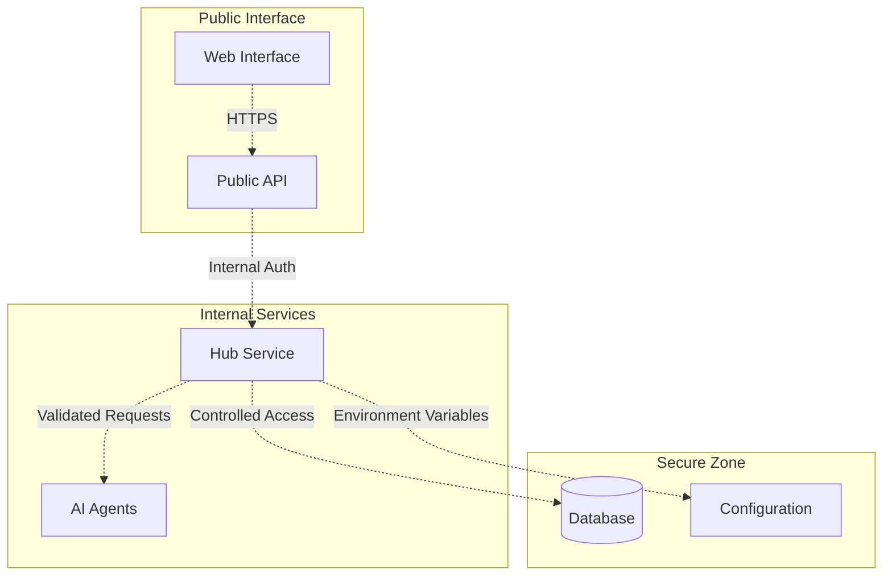

# Hive System Architecture Overview

*Engineering Blueprint and Technical Reference*

## System Overview

The Hive system is a distributed AI collaboration platform implementing modular microservice architecture with event-driven communication. The system provides real-time chat capabilities, AI agent integration, and metamorphosis-based onboarding workflows.

## Architecture Principles

- **Event-Driven Architecture**: All components communicate via standardized Pollen Protocol events
- **Microservice Design**: Loosely coupled components with clear API boundaries
- **AI-Human Symbiosis**: First-class support for both human and AI participants
- **Progressive Enhancement**: Capability-based feature enabling

## Component Architecture

### Core System Components

```mermaid
graph TB
    subgraph "Application Layer"
        WEB[Web Frontend<br/>Vue.js SPA]
        API[REST API<br/>FastAPI Backend]
        WS[WebSocket Gateway<br/>Real-time Communication]
    end

    subgraph "Business Logic Layer"
        HUB[Coordination Hub<br/>Central Orchestrator]
        GATEWAY[Welcome Gateway<br/>Onboarding Service]
        REGISTRY[Agent Registry<br/>Participant Management]
        DASHBOARD[Metrics Dashboard<br/>System Monitoring]
    end

    subgraph "Integration Layer"
        EVENT_BUS[Event Bus<br/>Pollen Protocol]
        AI_AGENTS[AI Agent Pool<br/>External Integrations]
    end

    subgraph "Data Layer"
        DATABASE[(SQLite Database<br/>Persistent Storage)]
        MEMORY[In-Memory State<br/>Active Sessions)]
    end

    WEB --> API
    API --> WS
    WS --> EVENT_BUS
    EVENT_BUS --> HUB
    HUB --> GATEWAY
    HUB --> REGISTRY
    HUB --> DASHBOARD
    GATEWAY --> AI_AGENTS
    REGISTRY --> AI_AGENTS
    API --> DATABASE
    HUB --> MEMORY
```

### Service Boundaries

| Component | Responsibility | API Interface | Dependencies |
|-----------|---------------|---------------|--------------|
| **Web Frontend** | User interface, real-time updates | WebSocket, REST | WebSocket Gateway |
| **API Backend** | HTTP endpoints, authentication | REST API | Database, Event Bus |
| **Coordination Hub** | Task orchestration, load balancing | Internal API | Registry, Gateway, Dashboard |
| **Welcome Gateway** | Onboarding workflows, validation | Internal API | Event Bus, AI Agents |
| **Agent Registry** | Participant lifecycle management | Internal API | Database, Event Bus |
| **Metrics Dashboard** | System health, performance monitoring | Internal API | Event Bus, Database |
| **Event Bus** | Message routing, protocol translation | Event Protocol | All Components |
| **AI Agents** | External AI service integration | Standard Interface | Event Bus |

## Communication Patterns

### Event-Driven Communication (Pollen Protocol)



### Standard Event Structure

```typescript
interface PollenEvent {
  event_id: string;          // Unique identifier
  event_type: string;        // Action type (past tense)
  source_component: string;  // Originating service
  target_component?: string; // Optional recipient
  aggregate_id?: string;     // Entity identifier
  payload: Record<string, any>; // Event data
  timestamp: string;         // ISO 8601 timestamp
  correlation_id?: string;   // Request tracking
}
```

## Data Architecture

### Database Schema



### State Management

- **Persistent State**: SQLite database for durable storage
- **Session State**: In-memory caching for active operations
- **Event State**: Event sourcing for audit trail and replay

## Integration Architecture

### AI Agent Integration



### Standard Agent Interface

```python
class HiveTeammate(ABC):
    @abstractmethod
    async def get_status(self) -> Dict[str, Any]:
        """Return current agent status and capabilities"""

    @abstractmethod
    async def process_task(self, task: Task) -> TaskResult:
        """Execute assigned task and return results"""

    @abstractmethod
    async def handle_event(self, event: PollenEvent) -> None:
        """Process incoming Pollen Protocol event"""
```

## Deployment Architecture

### Local Development



### Production Deployment



## Security Architecture

### Authentication & Authorization

- **Session Management**: HTTP session-based authentication
- **API Security**: Request validation and rate limiting
- **Agent Validation**: Onboarding workflow with multi-stage verification
- **Data Protection**: Input sanitization and output encoding

### Security Boundaries



## Performance Characteristics

### Scalability Metrics

- **Concurrent Users**: 100+ simultaneous connections
- **Message Throughput**: 1000+ messages/second
- **Agent Response Time**: <2 seconds average
- **Database Performance**: <100ms query response

### Monitoring Points

- **System Health**: CPU, memory, disk usage
- **Application Metrics**: Request rates, error rates, response times
- **Business Metrics**: Active users, message volume, agent utilization
- **Custom Metrics**: Tau (complexity), Phi (quality), Sigma (collaboration)

## Technology Stack

### Backend Technologies
- **Runtime**: Python 3.11+
- **Web Framework**: FastAPI
- **WebSocket**: Native FastAPI WebSocket support
- **Database**: SQLite (development), PostgreSQL (production)
- **Event Processing**: Custom Pollen Protocol implementation

### Frontend Technologies
- **Framework**: Vue.js 3 with Composition API
- **Build Tool**: Vite
- **Package Manager**: Bun
- **State Management**: Pinia
- **UI Components**: Custom component library

### Development Tools
- **Dependency Management**: uv (Python), Bun (JavaScript)
- **Code Quality**: ESLint, Prettier, Python Black
- **Testing**: pytest (Python), Vitest (JavaScript)
- **Type Checking**: TypeScript, Python type hints

## Configuration Management

### Environment Configuration

```bash
# Core System
HIVE_HOST=localhost
HIVE_PORT=8000
HIVE_DEBUG=false

# Database
DATABASE_URL=sqlite:///chat.db
DATABASE_POOL_SIZE=10

# External Services
MISTRAL_API_KEY=<api_key>
CLAUDE_API_KEY=<api_key>
GEMINI_API_KEY=<api_key>

# Security
SESSION_SECRET=<secret_key>
CORS_ORIGINS=["http://localhost:5173"]

# Monitoring
METRICS_ENABLED=true
LOG_LEVEL=INFO
```

### Feature Flags

```python
class HiveConfig:
    AI_AGENTS_ENABLED: bool = True
    METRICS_DASHBOARD_ENABLED: bool = True
    ONBOARDING_WORKFLOW_ENABLED: bool = True
    EXTERNAL_API_INTEGRATION: bool = True
    DEBUG_MODE: bool = False
```

---

## Migration Notes

This document serves as the authoritative architectural reference, replacing previous conceptual documentation. All system development should reference this specification for component boundaries, integration patterns, and deployment strategies.

**Document Version**: 1.0
**Last Updated**: 2025-09-22
**Status**: Engineering Specification
