# 🎨 Visual Chronicle Evolution: Pattern Recognition & Interactive Documentation

## Overview

The Enhanced Visual Chronicle System represents the evolution of bee.chronicler capabilities, integrating visual pattern recognition with Sacred Team documentation workflows. This system bridges the gap between traditional text-based chronicles and modern interactive visual documentation.

## Visual Pattern Recognition Architecture

### Core Components

#### 1. Pattern Detection Engine


#### 2. Visual Enhancement Pipeline


### Pattern Recognition Categories

#### ATCG Architecture Patterns
- **Aggregate Detection**: Identifies structural organization patterns
- **Transformation Recognition**: Spots data processing workflows
- **Connector Mapping**: Discovers integration points
- **Genesis Event Tracking**: Recognizes generative actions

#### Sacred Team Collaboration Patterns
- **Session Flow Analysis**: Maps collaboration session structures
- **Decision Point Recognition**: Identifies key decision moments
- **Consensus Building Patterns**: Tracks agreement formation
- **Knowledge Transfer Flows**: Maps learning and sharing patterns

#### Documentation Evolution Patterns
- **Content Growth Tracking**: Visualizes documentation expansion
- **Cross-Reference Networks**: Maps document interconnections
- **Update Frequency Analysis**: Identifies maintenance patterns
- **Quality Improvement Trends**: Tracks documentation enhancement

## Обзор

Улучшенная Система Визуальных Хроник представляет эволюцию возможностей bee.chronicler, интегрируя распознавание визуальных паттернов с рабочими процессами документации Священной Команды. Эта система соединяет традиционные текстовые хроники с современной интерактивной визуальной документацией.

## Архитектура Распознавания Визуальных Паттернов

### Основные Компоненты

#### 1. Движок Обнаружения Паттернов
Система сканирует документацию, обнаруживает паттерны, классифицирует их и применяет визуальные улучшения для создания интерактивных хроник.

#### 2. Конвейер Визуального Улучшения
Путешествие от обнаружения паттернов через визуальное улучшение до публикации интерактивных хроник с навигацией.

### Категории Распознавания Паттернов

#### Паттерны Архитектуры ATCG
- **Обнаружение Агрегатов**: Определяет паттерны структурной организации
- **Распознавание Трансформаций**: Обнаруживает рабочие процессы обработки данных
- **Картирование Коннекторов**: Находит точки интеграции
- **Отслеживание Событий Генезиса**: Распознает генеративные действия

#### Паттерны Сотрудничества Священной Команды
- **Анализ Потока Сессий**: Картирует структуры сессий сотрудничества
- **Распознавание Точек Решений**: Определяет ключевые моменты принятия решений
- **Паттерны Построения Консенсуса**: Отслеживает формирование соглашений
- **Потоки Передачи Знаний**: Картирует обучение и обмен знаниями

#### Паттерны Эволюции Документации
- **Отслеживание Роста Контента**: Визуализирует расширение документации
- **Сети Перекрестных Ссылок**: Картирует взаимосвязи документов
- **Анализ Частоты Обновлений**: Определяет паттерны обслуживания
- **Тренды Улучшения Качества**: Отслеживает улучшение документации

## Implementation Architecture

### Visual Pattern Recognition Engine

```python
class VisualPatternRecognitionEngine:
    """Enhanced pattern recognition for Sacred Team chronicles"""
    
    def __init__(self):
        self.pattern_detectors = {
            'atcg': ATCGPatternDetector(),
            'sacred_team': SacredTeamPatternDetector(),
            'collaboration': CollaborationPatternDetector(),
            'documentation': DocumentationPatternDetector()
        }
        self.visual_enhancers = {
            'mermaid': MermaidDiagramGenerator(),
            'interactive': InteractiveElementGenerator(),
            'sacred_theme': SacredThemeApplicator()
        }
        
    async def analyze_and_enhance(self, content: str, content_type: str) -> VisualChronicle:
        """Analyze content and generate enhanced visual chronicle"""
        
        # Pattern detection phase
        detected_patterns = await self.detect_patterns(content, content_type)
        
        # Visual enhancement phase
        visual_elements = await self.generate_visual_elements(detected_patterns)
        
        # Chronicle creation phase
        enhanced_chronicle = await self.create_enhanced_chronicle(
            content, detected_patterns, visual_elements
        )
        
        return enhanced_chronicle
    
    async def detect_patterns(self, content: str, content_type: str) -> List[DetectedPattern]:
        """Detect patterns in content using multiple detectors"""
        patterns = []
        
        for detector_name, detector in self.pattern_detectors.items():
            detected = await detector.detect(content, content_type)
            patterns.extend(detected)
        
        return self.merge_and_prioritize_patterns(patterns)
    
    async def generate_visual_elements(self, patterns: List[DetectedPattern]) -> List[VisualElement]:
        """Generate visual elements based on detected patterns"""
        visual_elements = []
        
        for pattern in patterns:
            if pattern.type == 'workflow':
                diagram = await self.visual_enhancers['mermaid'].create_flowchart(pattern)
                visual_elements.append(diagram)
            elif pattern.type == 'collaboration':
                journey = await self.visual_enhancers['mermaid'].create_journey(pattern)
                visual_elements.append(journey)
            elif pattern.type == 'architecture':
                graph = await self.visual_enhancers['mermaid'].create_graph(pattern)
                visual_elements.append(graph)
        
        # Apply Sacred Team theming
        for element in visual_elements:
            await self.visual_enhancers['sacred_theme'].apply_theme(element)
        
        return visual_elements
```

### Enhanced Chronicle Generator

```python
class EnhancedChronicleGenerator:
    """Generates enhanced chronicles with visual pattern recognition"""
    
    def __init__(self):
        self.pattern_engine = VisualPatternRecognitionEngine()
        self.template_engine = SacredTemplateEngine()
        self.bilingual_processor = BilingualProcessor()
        
    async def generate_chronicle(self, session_data: Dict[str, Any]) -> EnhancedChronicle:
        """Generate enhanced chronicle with visual patterns"""
        
        # Extract content for analysis
        content = self.extract_session_content(session_data)
        
        # Analyze patterns and generate visuals
        visual_chronicle = await self.pattern_engine.analyze_and_enhance(
            content, 'collaboration_session'
        )
        
        # Generate bilingual content
        bilingual_content = await self.bilingual_processor.process(visual_chronicle)
        
        # Apply Sacred Team template
        enhanced_chronicle = await self.template_engine.render(
            'enhanced_chronicle_template.md',
            {
                'session_data': session_data,
                'visual_elements': visual_chronicle.visual_elements,
                'detected_patterns': visual_chronicle.patterns,
                'bilingual_content': bilingual_content
            }
        )
        
        return enhanced_chronicle
```

## Visual Pattern Examples

### ATCG Architecture Visualization

```mermaid
graph LR
    subgraph "ATCG Pattern Recognition"
        A[Aggregate<br/>🏗️ Structure] --> T[Transform<br/>🔄 Process]
        T --> C[Connect<br/>🔗 Integrate]
        C --> G[Genesis<br/>✨ Generate]
        G --> A
    end
    
    subgraph "Visual Enhancement"
        DETECT[Pattern Detection] --> VISUAL[Visual Generation]
        VISUAL --> THEME[Sacred Theme]
        THEME --> INTERACTIVE[Interactive Elements]
    end
    
    A -.-> DETECT
    T -.-> DETECT
    C -.-> DETECT
    G -.-> DETECT
    
    style A fill:#FFD700
    style T fill:#FF6B35
    style C fill:#8B4513
    style G fill:#F0E68C
```



### Collaboration Flow Visualization


### Documentation Network Visualization

```mermaid
graph TB
    subgraph "Documentation Ecosystem"
        FOUNDATION[🏗️ Foundation Docs]
        DEVELOPMENT[💻 Development Docs]
        SACRED[🐝 Sacred Team Docs]
        API[🔧 API Reference]
    end
    
    subgraph "Cross-References"
        FOUNDATION --> DEVELOPMENT
        DEVELOPMENT --> API
        SACRED --> FOUNDATION
        SACRED --> DEVELOPMENT
        API --> SACRED
    end
    
    subgraph "Visual Enhancements"
        PATTERNS[Pattern Recognition]
        DIAGRAMS[Interactive Diagrams]
        NAVIGATION[Enhanced Navigation]
        SEARCH[Visual Search]
    end
    
    FOUNDATION -.-> PATTERNS
    DEVELOPMENT -.-> DIAGRAMS
    SACRED -.-> NAVIGATION
    API -.-> SEARCH
    
    style FOUNDATION fill:#FFD700
    style DEVELOPMENT fill:#FF6B35
    style SACRED fill:#8B4513
    style API fill:#F0E68C
```



## Interactive Features

### Pattern Highlighting
- **Hover Effects**: Highlight related patterns on mouse hover
- **Click Navigation**: Navigate to pattern definitions and examples
- **Pattern Filtering**: Filter content by pattern type
- **Pattern Search**: Search for specific patterns across chronicles

### Visual Navigation
- **Diagram Zoom**: Zoom and pan large diagrams
- **Layer Toggle**: Show/hide different pattern layers
- **Timeline Navigation**: Navigate through pattern evolution
- **Cross-Reference Links**: Jump between related visual elements

### Collaborative Features
- **Pattern Annotations**: Add comments to specific patterns
- **Visual Feedback**: Rate pattern recognition accuracy
- **Pattern Suggestions**: Suggest new patterns for recognition
- **Collaborative Editing**: Edit visual elements collaboratively

## Implementation Roadmap

### Phase 1: Core Pattern Recognition (Week 1)
- ✅ Implement basic pattern detection
- ✅ Create visual element generators
- ✅ Apply Sacred Team theming
- 🔄 Test with existing chronicles

### Phase 2: Enhanced Visualization (Week 2)
- 🔄 Add interactive diagram features
- 🔄 Implement pattern highlighting
- 🔄 Create visual navigation system
- 🔄 Add bilingual visual support

### Phase 3: Advanced Features (Week 3)
- 🔄 Implement collaborative visual editing
- 🔄 Add pattern learning capabilities
- 🔄 Create visual analytics dashboard
- 🔄 Integrate with Hive ecosystem

## Quality Metrics

### Pattern Recognition Accuracy
- **Detection Rate**: >90% for known patterns
- **False Positive Rate**: <5% for pattern detection
- **Classification Accuracy**: >85% for pattern types
- **Visual Quality Score**: >4.0/5.0 user rating

### User Experience Metrics
- **Navigation Efficiency**: <3 clicks to find related patterns
- **Visual Load Time**: <2 seconds for diagram generation
- **Mobile Compatibility**: >95% feature availability on mobile
- **Accessibility Score**: >AA WCAG compliance

### Chronicle Enhancement Metrics
- **Visual Element Coverage**: >80% of chronicles enhanced
- **Pattern Discovery Rate**: >5 new patterns per session
- **Cross-Reference Accuracy**: >95% valid links
- **Bilingual Completeness**: >90% content translated

## Future Enhancements

### AI-Powered Pattern Learning
- **Machine Learning Integration**: Learn new patterns from user behavior
- **Predictive Pattern Recognition**: Suggest patterns before they're fully formed
- **Adaptive Visual Generation**: Improve visual elements based on usage
- **Intelligent Cross-Referencing**: Automatically discover related content

### Advanced Visualization
- **3D Pattern Visualization**: Three-dimensional pattern relationships
- **Animated Pattern Evolution**: Show how patterns change over time
- **Virtual Reality Chronicles**: Immersive chronicle exploration
- **Augmented Reality Patterns**: Overlay patterns on real-world documentation

### Integration Expansion
- **External Tool Integration**: Connect with design tools and IDEs
- **API for Pattern Recognition**: Allow external systems to use pattern engine
- **Real-time Collaboration**: Live pattern recognition during sessions
- **Cross-Platform Synchronization**: Sync patterns across different platforms

---

*Enhanced Visual Chronicle System*  
*Powered by Sacred Team Pattern Recognition*  
*Integrated with bee.chronicler v2.0*  
*Visual Excellence for Living Documentation*