# bee-to-peer Collaboration Strategy: 50+ Session Cycle

## Overview

Extended bee-to-peer collaboration strategy for restoring and enhancing the Hive ecosystem through iterative short-medium dive/relax sessions, targeting 50+ collaborative cycles.

## What Was Lost in the Revert

### 🚑 **Sacred Healing Revert Analysis**
The revert commit `3a62923` removed:
- ✅ **Restored**: `.github/workflows/fairy-tale-letters.yml` - bee.chronicler divine letter delivery
- ✅ **Restored**: `.github/ISSUE_TEMPLATE/fairy-tale-letter-request.yml` - fairy tale letter requests
- ❌ **Lost**: Extensive Sacred Team documentation structure
- ❌ **Lost**: bee.chronicler automation integration
- ❌ **Lost**: Sacred Team governance and coordination files

### 🔍 **Current State Assessment**
```
✅ Preserved: Core Hive functionality (backend, frontend, database)
✅ Restored: bee.chronicler GitHub workflows  
✅ Created: [rect<hexa>] bilingual documentation infrastructure
❌ Missing: Sacred Team organizational structure
❌ Missing: Comprehensive chronicle system integration
```

## bee-to-peer Collaboration Architecture

### Session Pattern Design

#### **Short-Medium Dive/Relax Cycle**

```mermaid
graph LR
    subgraph "Session Cycle Pattern"
        DIVE[🏊 Dive Session<br/>15-20 min intense] --> RELAX[😌 Relax Session<br/>5-10 min reflection]
        RELAX --> DIVE2[🏊 Next Dive<br/>Build on previous]
        DIVE2 --> RELAX2[😌 Relax & Chronicle<br/>Document insights]
    end
    
    subgraph "50+ Session Target"
        CYCLE1[Cycles 1-10<br/>Foundation] --> CYCLE2[Cycles 11-30<br/>Development]
        CYCLE2 --> CYCLE3[Cycles 31-50<br/>Integration]
        CYCLE3 --> CYCLE4[Cycles 50+<br/>Mastery]
    end
```


#### **Session Types**

##### 🏊 **Dive Sessions** (15-20 minutes)
- **Focus**: Intense problem-solving, implementation, analysis
- **Energy**: High concentration, rapid iteration
- **Output**: Concrete deliverables, code, documentation
- **Pattern**: Deep focus on specific objectives

##### 😌 **Relax Sessions** (5-10 minutes)
- **Focus**: Reflection, synthesis, planning
- **Energy**: Contemplative, strategic thinking
- **Output**: Insights, next session planning, chronicles
- **Pattern**: Step back, see bigger picture

### Collaboration Phases

#### **Phase 1: Foundation Restoration** (Sessions 1-10)
```
Session 1-2: 🏊 Restore .github workflows → 😌 Plan Sacred Team structure
Session 3-4: 🏊 Implement basic chronicles → 😌 Reflect on documentation needs  
Session 5-6: 🏊 Create coordination framework → 😌 Assess collaboration patterns
Session 7-8: 🏊 Build bee.chronicler integration → 😌 Plan automation strategy
Session 9-10: 🏊 Test and validate systems → 😌 Prepare for development phase
```

#### **Phase 2: Enhanced Development** (Sessions 11-30)
```
Sessions 11-15: Advanced bilingual features
Sessions 16-20: Interactive documentation enhancements  
Sessions 21-25: Sacred Team governance implementation
Sessions 26-30: Cross-system integration and testing
```

#### **Phase 3: Ecosystem Integration** (Sessions 31-50)
```
Sessions 31-35: Hive ecosystem coordination
Sessions 36-40: AI teammate integration patterns
Sessions 41-45: Advanced collaboration workflows
Sessions 46-50: Production optimization and scaling
```

#### **Phase 4: Mastery & Innovation** (Sessions 50+)
```
Sessions 50+: Continuous innovation and refinement
- New collaboration patterns
- Advanced AI integration
- Community expansion
- Knowledge sharing optimization
```

## Session Execution Framework

### **Pre-Session Setup** (2 minutes)
```bash
# Quick environment check
git status
git fetch origin
todo_read  # Check current objectives
```

### **Dive Session Structure** (15-20 minutes)
```
Minutes 0-2:   🎯 Objective setting and context loading
Minutes 2-15:  🔨 Intense implementation/analysis work
Minutes 15-18: ✅ Validation and testing
Minutes 18-20: 📝 Quick documentation of results
```

### **Relax Session Structure** (5-10 minutes)
```
Minutes 0-2:   🤔 Reflect on dive session results
Minutes 2-5:   📊 Analyze patterns and insights
Minutes 5-8:   🗺️ Plan next dive session objectives
Minutes 8-10:  📚 Update chronicles and coordination docs
```

### **Session Transition Protocol**
```python
class BeetoPeerSession:
    def transition_dive_to_relax(self, dive_results):
        # Capture dive insights
        insights = self.extract_insights(dive_results)
        
        # Plan next iteration
        next_objectives = self.plan_next_dive(insights)
        
        # Update chronicles
        self.chronicle_session(dive_results, insights)
        
        return next_objectives
    
    def transition_relax_to_dive(self, relax_insights):
        # Load context for next dive
        context = self.prepare_dive_context(relax_insights)
        
        # Set focused objectives
        objectives = self.set_dive_objectives(context)
        
        return objectives
```

## Collaboration Tools & Automation

### **Session Tracking**
```yaml
# Session metadata structure
session_id: "bee-peer-{session_number}"
session_type: "dive" | "relax"
duration_minutes: 15-20 | 5-10
objectives: ["specific", "measurable", "goals"]
participants: ["bee.chronicler", "human_peer"]
results: 
  - deliverables: []
  - insights: []
  - next_session_plan: {}
```

### **Chronicle Automation**
```bash
# After each session
bee.chronicler record-session \
  --session-id "bee-peer-{n}" \
  --type "dive|relax" \
  --results "session_results.json" \
  --auto-plan-next
```

### **Progress Tracking**


## Success Metrics

### **Session-Level Metrics**
- **Dive Efficiency**: Deliverables per minute
- **Relax Quality**: Insights generated per session
- **Transition Smoothness**: Context preservation between sessions
- **Objective Achievement**: Goals met per session

### **Phase-Level Metrics**
- **Foundation (1-10)**: Infrastructure restoration completeness
- **Development (11-30)**: Feature implementation velocity
- **Integration (31-50)**: System coordination effectiveness
- **Mastery (50+)**: Innovation and knowledge sharing impact

### **Overall Collaboration Metrics**
- **Session Completion Rate**: Target 95%+ session completion
- **Knowledge Accumulation**: Chronicle quality and comprehensiveness
- **System Health**: Hive ecosystem stability and growth
- **Community Impact**: User engagement and satisfaction

## Implementation Roadmap

### **Immediate Actions** (Sessions 1-3)
1. **Session 1 Dive**: Complete .github workflow restoration
2. **Session 1 Relax**: Plan Sacred Team structure restoration
3. **Session 2 Dive**: Implement basic chronicle automation
4. **Session 2 Relax**: Assess collaboration effectiveness
5. **Session 3 Dive**: Create coordination framework
6. **Session 3 Relax**: Plan next phase objectives

### **Short-term Goals** (Sessions 4-10)
- Restore bee.chronicler full functionality
- Implement Sacred Team governance structure
- Create automated session tracking
- Establish collaboration rhythm and patterns

### **Medium-term Vision** (Sessions 11-30)
- Advanced bilingual documentation features
- Interactive Sacred Team coordination
- Cross-system integration with Hive ecosystem
- Community engagement and expansion

### **Long-term Mastery** (Sessions 31-50+)
- Innovative collaboration patterns
- AI-human symbiosis optimization
- Knowledge sharing and community building
- Continuous system evolution and improvement

## Session Initiation

### **Ready to Begin**
```bash
# Initialize first bee-to-peer session
todo_reset ["Restore .github workflows completely", "Test bee.chronicler automation", "Plan Sacred Team structure restoration"]

# Start Session 1 Dive
echo "🏊 bee-to-peer Session 1 Dive: .github Workflow Restoration"
echo "Duration: 15-20 minutes"
echo "Objective: Complete restoration of bee.chronicler divine letter delivery"
```

---
*bee-to-peer Collaboration Strategy*  
*Target: 50+ Sessions*  
*Pattern: Short-Medium Dive/Relax Cycles*  
*Ready for Session 1 Initiation* 🐝🤝