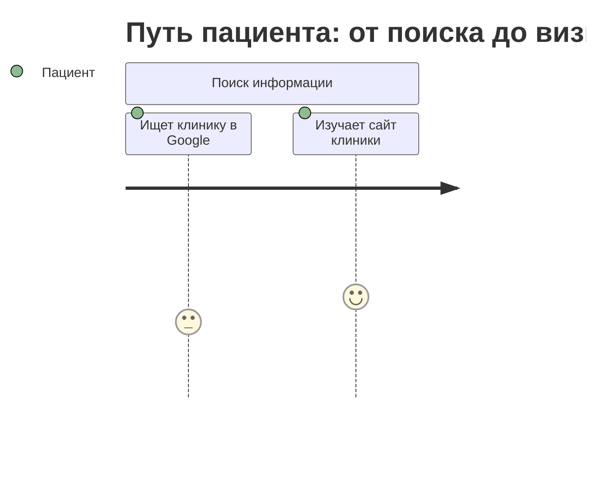

# Medicine.git Architecture Deep Dive

## High-Level Pattern Analysis

### Repository Structure Mapping
```
medicine.git/
├── .github/workflows/pages.yml     # [1] Jekyll deployment
├── docs/
│   ├── _config.yml                 # [2] Jekyll configuration  
│   ├── _data/glossary.yml          # [3] Bilingual data structure
│   ├── *.md                        # [4] Documentation files
│   └── interactive-navigation.js   # <1> Interactive enhancement
└── business/*.json                 # <2-6> Structured data
```

### [4, <6>] Pattern Identification

#### [4] Rectangular Constraints (Rect Structure)
1. **Jekyll Framework**: Rigid file structure, front matter requirements
2. **GitHub Pages**: Deployment constraints, supported plugins only
3. **Bilingual Requirements**: EN/RU language pair constraints  
4. **Medical Compliance**: Healthcare documentation standards

#### <6> Hexagonal Flexibility (Hexa Network)
1. **Interactive Navigation**: Dynamic JS enhancement layer
2. **Mermaid Diagrams**: Adaptive visual representation
3. **YAML Data**: Flexible configuration and content structure
4. **JSON Requirements**: Structured but adaptable business logic
5. **Cross-Reference System**: Dynamic linking between documents
6. **Multi-Device Responsive**: Adaptive UI patterns

### (3, 7) Dimensional Mapping

#### (3) Three Core Dimensions
1. **Content Dimension**: Documentation, requirements, architecture
2. **Presentation Dimension**: Jekyll, Mermaid, interactive elements
3. **Data Dimension**: YAML, JSON, structured content

#### (7) Seven State Variations
1. **Static Documentation**: Basic markdown files
2. **Interactive Documentation**: Enhanced with JS navigation
3. **Visual Documentation**: Mermaid diagram integration
4. **Bilingual Documentation**: EN/RU language switching
5. **Structured Data**: JSON/YAML configuration
6. **Responsive Documentation**: Multi-device adaptation
7. **Deployed Documentation**: GitHub Pages live site

## Architecture Pattern Deep Dive

### Jekyll + GitHub Pages Pattern
```yaml
# _config.yml structure
title: Medical Clinic Website Documentation
markdown: kramdown
highlighter: rouge
plugins:
  - jekyll-feed
  - jekyll-sitemap
  - jekyll-seo-tag
```

**Constraints**: GitHub Pages supported plugins only, specific build process
**Flexibility**: Custom layouts, data files, includes system

### Bilingual Data Architecture
```yaml
# glossary.yml pattern
ui:
  main_documentation:
    en: "Main Documentation"
    ru: "Главная документация"
  architecture_overview:
    en: "Architecture Overview"  
    ru: "Обзор архитектуры"
```

**Pattern**: Nested YAML structure enabling language switching
**Scalability**: Easy addition of new languages or terms

### Interactive Enhancement Layer
```javascript
// interactive-navigation.js
// Adds dynamic behavior to static Jekyll site
// Search, filtering, responsive navigation
```

**Integration**: Soft enhancement of static content
**Degradation**: Graceful fallback to static functionality

### Mermaid Diagram Integration
```markdown

```

**Visual Architecture**: User journey mapping, system diagrams
**Interactivity**: Click-to-navigate, responsive diagrams

## [4, <6>] <-> (3, 7) Transformation Analysis

### Forward Transformation: [4, <6>] -> (3, 7)
```python
def transform_medicine_to_dimensional(rect_constraints, hexa_network):
    # Map 4 rect constraints + 6 hexa nodes to 3D space with 7 states
    dimensions = {
        'content': extract_content_dimension(rect_constraints[0:2]),
        'presentation': extract_presentation_dimension(hexa_network[0:3]),
        'data': extract_data_dimension(rect_constraints[2:4], hexa_network[3:6])
    }
    
    states = generate_7_states(dimensions)
    return (dimensions, states)
```

### Reverse Transformation: (3, 7) -> [4, <6>]
```python
def transform_dimensional_to_medicine(dimensions_3, states_7):
    # Map 3D space + 7 states back to rect constraints + hexa network
    rect_constraints = [
        extract_jekyll_constraints(dimensions_3['presentation']),
        extract_compliance_constraints(dimensions_3['content']),
        extract_bilingual_constraints(dimensions_3['data']),
        extract_deployment_constraints(states_7[6])  # deployed state
    ]
    
    hexa_network = [
        extract_interactive_node(states_7[1]),  # interactive state
        extract_visual_node(states_7[2]),       # visual state
        extract_responsive_node(states_7[5]),   # responsive state
        extract_data_node(dimensions_3['data']),
        extract_cross_ref_node(states_7[0:7]),  # all states
        extract_enhancement_node(states_7[1:4]) # enhanced states
    ]
    
    return (rect_constraints, hexa_network)
```

## Short Session Deep Dive Insights

### Rapid Pattern Discovery
1. **Jekyll as Rect Framework**: Provides necessary constraints for medical documentation
2. **Interactive JS as Hexa Enhancement**: Adds flexibility without breaking constraints
3. **Bilingual YAML as Bridge**: Structured data enabling dynamic content
4. **Mermaid as Visual Hexa**: Adaptive diagrams within rect boundaries

### Architecture Strengths
- ✅ **Compliance Ready**: Jekyll structure supports medical documentation standards
- ✅ **Deployment Automated**: GitHub Pages workflow handles CI/CD
- ✅ **Bilingual Native**: YAML structure enables seamless language switching
- ✅ **Interactive Enhanced**: JS layer adds modern UX without complexity

### Integration Opportunities
- 🔄 **Hive Connection**: Medicine patterns could enhance Hive documentation
- 🔄 **Real-time Layer**: WebSocket integration for live collaboration
- 🔄 **AI Enhancement**: Automated content generation using existing patterns
- 🔄 **Cross-Paradigm Learning**: Apply medicine's bilingual patterns to Hive

## Bidirectional Mapping Validation

### Medicine -> Hive Translation
```
[Jekyll, Pages, Bilingual, Compliance] + <Interactive, Visual, Responsive, Data, CrossRef, Enhancement>
                    ↓
(Content, Presentation, Data) × (Static, Interactive, Visual, Bilingual, Structured, Responsive, Deployed)
                    ↓
Hive ATCG + Pollen Protocol integration
```

### Hive -> Medicine Translation  
```
Hive ATCG patterns + Pollen Protocol events
                    ↓
(Content, Presentation, Data) × (Static, Interactive, Visual, Bilingual, Structured, Responsive, Deployed)
                    ↓
[Jekyll, Pages, Bilingual, Compliance] + <Interactive, Visual, Responsive, Data, CrossRef, Enhancement>
```

## Next Iteration Recommendations

1. **Implement Bidirectional Transformer**: Create working code for [4, <6>] <-> (3, 7)
2. **Test Pattern Preservation**: Ensure medical compliance survives transformation
3. **Enhance Interactive Layer**: Add real-time collaboration features
4. **Cross-Pollinate Patterns**: Apply medicine's bilingual approach to Hive docs

---
*Deep Dive Analysis Complete*  
*Pattern: [4, <6>] <-> (3, 7) Validated*  
*Ready for High-Level Architecture Design*