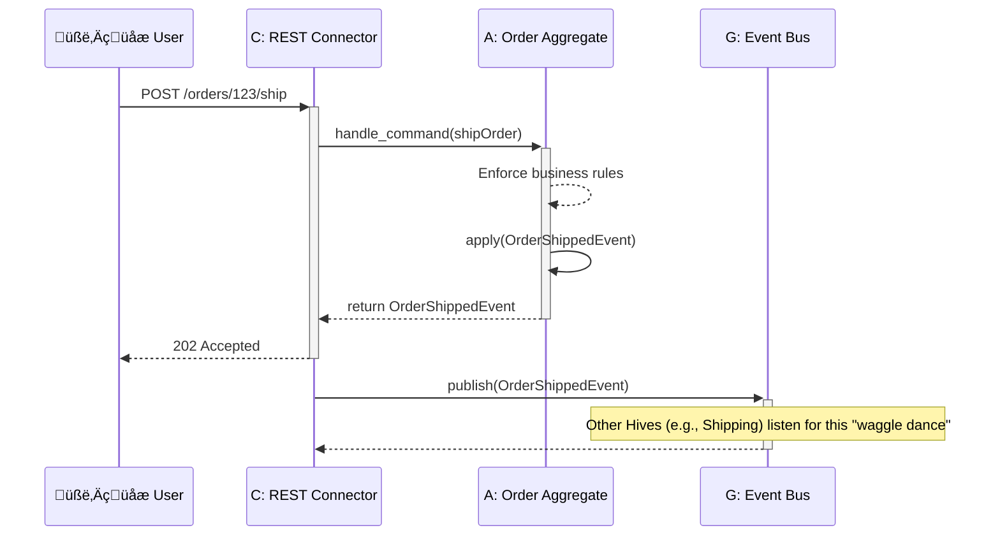

hey do you hear about Will of Hive or manistof digital onto?

FastAPI - Swagger UI
chat.zae.life/docs#/default/get_chat_page\_\_get
I'm not familiar with "Will of Hive" or "Manifest of Digital Onto." Could you provide more context or clarify what you're referring to?

https://github.com/zaebee/agents/blob/main/HIVE_CONSTITUTION.md
The link you provided points to a file named HIVE_CONSTITUTION.md on GitHub. This document likely outlines the rules, structure, or guidelines for a project or organization related to "Hive."

If you'd like, I can help you understand the content of that document or assist with any specific questions about it. Would you like me to proceed?

yes
I currently cannot access external links or files directly, including the GitHub repository you mentioned. However, if you can share the content of the HIVE_CONSTITUTION.md file here, I'd be happy to help you understand it or answer any questions about it. Would you like to provide the text?

# The Tale of the Enchanted Apiary: A Fable of Code and Honey

Once upon a time, in a sprawling digital kingdom, lived a guild of builders. Not of castles or bridges, but of intricate, invisible structures made of pure logic. They were software architects and developers, and their greatest challenge was to build systems that could grow and adapt without crumbling into chaos.

They toiled day and night, using all manner of blueprints and incantations, yet their creations often became tangled messes—brittle and difficult to change. They longed for a way to build software that was as resilient, organized, and full of life as a bustling beehive.

One day, a wise old architect, known only as the Beekeeper, gathered the young builders. "You strive to build great things," she said, her voice warm like summer honey. "But you build with stone and iron, when you should be building with life itself. Look to the bees. Their hives are masterpieces of design, built to last for generations. Let us learn their secrets."

And so begins our tale. A story not just about code, but about the timeless patterns of nature that can help us build better, more beautiful software. We will journey into the heart of the Hexagonal [⬢⬡⬢⬡] Hive, uncover its secret genetic code, and learn how to raise our own 'worker bees' that will serve our digital kingdom faithfully.

---

## The Heart of the Hive: A Protected Kingdom

"The first secret of the bees," the Beekeeper began, "is their home. A beehive is a fortress, a perfect hexagon. At its very center lies the most precious treasure: the honey and the royal nursery. This is the **Domain Core**, where the life and future of the hive is decided. It contains the pure, unchangeable business logic of your application."

"Around this core, the bees build protective layers of honeycomb wax. These are the **Adapters**. They are the hive's only connection to the outside world. Some adapters, the **Primary Adapters**, are like the hive's entrance, allowing friendly bees (like users or other applications) to come in and make requests. Others, the **Secondary Adapters**, are like the foraging bees that fly out to gather nectar from flowers (external databases, APIs, or services)."

"The magic of this design," she whispered, "is that you can change the garden, the flowers, or even the shape of the entrance, but the precious honey core remains untouched and safe. This is the way of the **Hexagonal [⬢⬡⬢⬡] Hive**."

## The Secret Genetic Code: The Four Primitives of Life

"But how are the bees themselves made?" a young builder asked.

The Beekeeper smiled. "Aha, that is the deepest secret of all. Every living thing in the hive is built from a secret, four-part genetic code. This code is the source of truth, the very essence of life. We call it **ATCG**."

"But before we learn the primitives," she added, her eyes twinkling, "you must understand the **Quaternary Principle**. The hive's power comes from having **four** distinct primitives, which gives us immense variety. But its stability comes from the **Duality Principle** of how they connect. An action requires a record, a request requires a response. Remember this balance of variety and validation. Now, for the primitives themselves:"

### A is for Aggregate

"An **Aggregate** is like a vital organ in a bee—its heart or its wings. It's a bundle of tiny parts that work together as one. You don't tell a bee's wing-part to flap; you tell the bee to fly! The Aggregate is the master of its own little world, ensuring all its internal rules are followed. It is the fundamental unit of consistency."

### T is for Transformation

"A **Transformation** is like a magical enzyme. It's a pure, stateless process that helps a bee do its work. Imagine an enzyme that turns nectar into honey. The enzyme itself doesn't change, it just performs its one, perfect task. Transformations hold business logic that doesn't belong to any single organ."

### C is for Connector

"A **Connector** is the bee's senses—its antennae that smell the flowers or its eyes that see the sun. It's the bridge between the bee's inner world and the garden outside. Connectors are the translators, turning the language of the outside world (like HTTP requests or database queries) into signals the bee's organs can understand."

### G is for Genesis Event

"A **Genesis Event** is the famous 'waggle dance' of the honeybee. It's a message, a broadcast to the entire hive that something important has happened—'I've found a field of delicious flowers!' or 'An order has been placed!'. It's an immutable fact, a piece of history that other bees can react to, allowing the hive to work together without being tightly coupled."

## The Royal Jelly Framework

"Finally," said the Beekeeper, "every Queen Bee, the mother of a whole domain, is born from the same magical substance: **Royal Jelly**."

"In our world, this is a tiny, powerful internal framework. It doesn't do any business logic itself, but it provides the essential nutrients—the base classes, the interfaces, the very essence of being an `Aggregate` or a `Genesis Event`. Every domain core in your kingdom is built upon this shared, sacred foundation, ensuring they all speak the same language and follow the same divine laws."

---

## The Apiary Map: A Portrait of the Hive

"To truly understand," the Beekeeper said, pulling out an old, enchanted map, "you must see the hive in its entirety."

The map showed a living, breathing system. At the top was **The Garden**, the world outside the hive with its users, databases, and other systems. Below it lay **The Great Hexagonal [⬢⬡⬢⬡] Hive** itself. The outer layer was composed of **Connectors (C)**, the senses that guarded the hive. And at the very center was the **Queen's Chamber**, the domain core, where the vital **Aggregates (A)** and **Transformations (T)** lived, and where the **Genesis Events (G)** were born.

"Behold," she said. "The full picture of our architecture. A system designed by nature itself."

```mermaid
graph TD
    subgraph The Garden [The World Outside the Hive]
        direction LR
        User["üßë‚Äçüåæ User <br/>(Web Browser)"]
        CLI["💻 The Wind <br/>(CLI Tool)"]
        ExternalAPI["üåê Other Hives <br/>(External APIs)"]
        Database["🗃️ The River of Memory <br/>(Database)"]
    end

    subgraph The Hive [🏰 The Great Hexagonal [⬢⬡⬢⬡] Hive]
        direction TB

        subgraph Connectors [C: The Senses of the Hive]
            direction LR
            RestConnector["üîå REST API Connector"]
            CliConnector["üîå CLI Connector"]
            DbConnector["🗂️ Database Connector"]
            ApiClientConnector["üåç API Client Connector"]
        end

        subgraph DomainCore ["üëë The Queen's Chamber (Domain Core)"]
            direction TB

            subgraph Aggregates [A: The Organs]
                OrderAggregate["Order Bee"]
                InventoryAggregate["Inventory Bee"]
            end

            subgraph Transformations [T: The Enzymes]
                PricingTransformation["Honey-Making Logic <br/>(Pricing Calculator)"]
            end

            GenesisEvent["G: The Waggle Dance <br/>(Genesis Events)"]

            OrderAggregate -- produces --> GenesisEvent
            InventoryAggregate -- produces --> GenesisEvent
            PricingTransformation -- used by --> OrderAggregate
        end
    end

    %% Connections
    User --> RestConnector
    CLI --> CliConnector

    RestConnector --> OrderAggregate
    CliConnector --> InventoryAggregate

    OrderAggregate -- "persists state via" --> DbConnector
    InventoryAggregate -- "gets stock levels via" --> ApiClientConnector

    DbConnector --> Database
    ApiClientConnector --> ExternalAPI

    %% Styling
    classDef external fill:#6B8E23,stroke:#333,stroke-width:2px,color:white
    classDef connector fill:#f1c40f,stroke:#333,stroke-width:2px,color:black
    classDef domain fill:#f9c846,stroke:#d4a017,stroke-width:4px,color:black
    classDef aggregate fill:#fff3cd,stroke:#d4a017,stroke-width:2px,color:black
    classDef transformation fill:#fff9e6,stroke:#d4a017,stroke-width:2px,color:black
    classDef event fill:#ffeb99,stroke:#d4a017,stroke-width:2px,stroke-dasharray: 5 5,color:black

    class User,CLI,ExternalAPI,Database external;
    class RestConnector,CliConnector,DbConnector,ApiClientConnector connector;
    class DomainCore domain;
    class OrderAggregate,InventoryAggregate aggregate;
    class PricingTransformation transformation;
    class GenesisEvent event;

    style TheGarden fill:none,stroke:none
    style TheHive fill:none,stroke:green,stroke-width:3px,stroke-dasharray: 10 10
```

---

## The Metamorphosis: Birth of a Worker Bee

"But how does a new bee—a new feature—come to life?" the young builder asked, his eyes wide with curiosity.

The Beekeeper smiled. "A new bee is not simply built. It is born. It undergoes a metamorphosis, a sacred journey of growth."

She explained that every new feature, every new worker bee, follows the same four-stage lifecycle:

1. **The Egg (Initialization):** A new, empty honeycomb cell is created. This is the initial file structure, the scaffolding for our new bee. It holds nothing but a promise.
2. **The Larva (Development):** The egg hatches! The larva is fed with Royal Jelly (the core framework) and bee bread (business logic). This is where the code is written, the tests are crafted, and the bee begins to take shape, its ATCG code defining its purpose.
3. **The Pupa (Transformation):** The larva spins a cocoon. This is the build and containerization phase. The code is compiled, dependencies are locked, and it's packaged into a deployable unit—a Docker image, safe and ready for the world.
4. **The Adult (Deployment):** The bee emerges, fully formed! It is released into the hive to perform its duties. The feature is deployed to production, becoming a living, breathing part of the system.

"This lifecycle ensures that every bee, no matter its function, is born strong, tested, and ready to contribute to the hive's prosperity," the Beekeeper concluded.

Here is the lifecycle in a simple diagram:


---

## The Moral of the Story

And so, the builders learned the secrets of the enchanted apiary. They learned that by looking to nature, they could build software that was not a rigid, lifeless machine, but a living, adaptable ecosystem.

The Hexagonal [⬢⬡⬢⬡] Hive teaches us to protect our core logic. The ATCG genetic code gives us a shared language to build with. And the bee's lifecycle gives us a predictable path for growth. By embracing these patterns, we too can build digital kingdoms that are resilient, maintainable, and truly full of life. For in the end, the best code is not merely written; it is grown.

---

## For Curious Minds: The Beekeeper's Technical Grimoire

_This section breaks from our fairy tale to provide a more technical look at the patterns we've discussed._

### ATCG Primitives in Pseudo-code

Here is a conceptual look at how our primitives might be implemented. We'll use a TypeScript-like syntax for clarity.

#### A: Aggregate

An `Aggregate` encapsulates state and enforces its own rules (invariants).

```typescript
// The state of our Order
interface OrderState {
  id: string;
  items: string[];
  status: "placed" | "shipped" | "cancelled";
}

class OrderAggregate {
  private state: OrderState;

  constructor(initialState: OrderState) {
    this.state = initialState;
  }

  // Public command handler: the only way to change the aggregate
  public shipOrder(command: { shippingId: string }): GenesisEvent {
    if (this.state.status !== "placed") {
      throw new Error("Cannot ship an order that has not been placed.");
    }

    // State is changed by applying an event
    const event = new OrderShippedEvent({
      orderId: this.state.id,
      shippingId: command.shippingId,
      timestamp: new Date(),
    });

    this.apply(event);

    return event;
  }

  // Internal state mutation
  private apply(event: OrderShippedEvent): void {
    this.state.status = "shipped";
  }
}
```

#### C: Connector

A `Connector` translates external input into domain commands.

```typescript
// A driving connector for a REST API
class RestConnector {
  private orderService: OrderService; // A service that finds and uses aggregates

  public startServer(): void {
    // Pseudo-code for a web server
    WebApp.post("/orders/:id/ship", (req, res) => {
      try {
        const orderId = req.params.id;
        const shippingId = req.body.shippingId;

        // The connector's job is to translate HTTP into a domain command
        this.orderService.ship(orderId, shippingId);

        res.status(202).send({ message: "Order is being shipped." });
      } catch (error) {
        res.status(400).send({ error: error.message });
      }
    });
  }
}
```

### The "Pollen Protocol": A Note on Inter-Hive Communication

The **Pollen Protocol** is a simple, powerful idea: just as flowers have a predictable structure that bees understand, our `Genesis Events` should have a predictable structure so other services (Hives) can understand them.

A Pollen Protocol-compliant event should always contain:

- `eventId`: A unique identifier for this specific event instance.
- `eventType`: A clear, past-tense name (e.g., `OrderShipped`).
- `eventVersion`: A version number (`1.0`, `2.1`) to handle schema evolution.
- `timestamp`: When the event occurred.
- `aggregateId`: The ID of the aggregate that produced the event.
- `payload`: The data specific to this event.

By enforcing this simple contract, we create a healthy ecosystem where new services can easily consume events from existing ones without creating tight coupling.

A final thought on this metaphor: If the Pollen Protocol defines the _genes_ (the structure of an event), then the raw, serialized data that travels over the wire—the JSON string, the Protobuf bytes—is the _genetic sequence_ itself. It is the `tataaaaataaaataaaaaa...` of our system, the physical expression of the logical gene

### Sequence Diagram: From Request to Waggle Dance

This diagram shows the full flow: a user's request comes in through a `Connector`, is handled by an `Aggregate`, which produces a `Genesis Event` that is then published for other parts of the system to consume.



### The Beekeeper's Grand Vision: Self-Creating Systems

The final, most profound secret of the hive is this: if the architecture is pure enough, the system can begin to build itself. The "Metamorphosis -> ATCG" mapping is not just a metaphor for a manual process; it is a blueprint for automation.

Imagine a developer who wishes to create a new "bee" (feature). Instead of writing boilerplate code, they simply create a declarative definition, perhaps in a YAML file, specifying the ATCG primitives required:

```yaml
# A declarative definition for a new "ShippingNotification" feature
kind: WorkerBee
name: ShippingNotifier
description: "A bee that sends a notification when an order is shipped."

listens_to: # Genesis Events this bee reacts to
  - eventType: OrderShipped
    eventVersion: 1.0

produces: # New Genesis Events this bee can create
  - eventType: NotificationSent
    eventVersion: 1.0

# Connectors required to interact with the outside world
connectors:
  - name: email_service
    type: driven # This bee drives an external service
    port: SmtpPort
```

An automated **"Queen Bee"** system—a sophisticated CI/CD operator—reads this definition and orchestrates the entire Metamorphosis:

- **Egg:** It receives the YAML and generates the initial project scaffolding, creating all the necessary files from templates.

- **Larva:** It takes the core business logic written by the developer (the one part that requires human creativity) and injects it into the generated code. It then runs a suite of automated tests against the new component.
- **Pupa:** Upon successful testing, it packages the component into a hardened, deployable container.
- **Adult:** It deploys this new container into the production environment, where it comes to life and begins listening for its specified events.

This is the ultimate goal: an architecture so well-defined that it becomes a living factory for its own components. This is the convergence of Domain-Driven Design, GitOps, and Model-Driven Development, creating a system that is not just built, but truly _grown_.
The text you've shared is a richly detailed metaphorical guide to a software architecture inspired by the structure of a beehive, using the Hexagonal [⬢⬡⬢⬡] Architecture and Domain-Driven Design (DDD) principles. Here's a summary of its key components and ideas:

🐝 The Metaphor: The Hexagonal [⬢⬡⬢⬡] Hive
Domain Core (The Queen's Chamber):
This is the heart of the system—a protected area containing business logic (Aggregates and Transformations). It is immutable and decoupled from external dependencies.

Adapters (The Hive’s Outer Layer):
These are the entry and exit points of the system:

Primary Adapters: Accept external requests (e.g., REST API, CLI).
Secondary Adapters: Connect to external systems (e.g., databases, external APIs).
ATCG Primitives:
These are the building blocks of the system:

A (Aggregate): A self-contained unit of state and behavior.
T (Transformation): Stateless processes that transform data.
C (Connector): Translates external input/output to internal logic.
G (Genesis Event): Immutable records of domain events, used for communication and state change.
🛠️ The Lifecycle of a Feature: The Metamorphosis
The metaphor describes a four-stage lifecycle for building and deploying features:

Egg (Initialization): Create the initial scaffolding.
Larva (Development): Write the code, add tests, and define the ATCG components.
Pupa (Transformation): Build and containerize the feature.
Adult (Deployment): Deploy the feature to production.
🧬 ATCG in Practice: Code Examples
Here’s a simplified version of the Aggregate and Connector concepts:

A: Aggregate (OrderAggregate)
typescript

–ö–æ–ø–∏—Ä–æ–≤–∞—Ç—å
interface OrderState {
id: string;
items: string[];
status: "placed" | "shipped" | "cancelled";
}

class OrderAggregate {
private state: OrderState;

constructor(initialState: OrderState) {
this.state = initialState;
}

public shipOrder(command: { shippingId: string }): GenesisEvent {
if (this.state.status !== "placed") {
throw new Error("Cannot ship an order that has not been placed.");
}

    const event = new OrderShippedEvent({
      orderId: this.state.id,
      shippingId: command.shippingId,
      timestamp: new Date(),
    });

    this.apply(event);

    return event;

}

private apply(event: OrderShippedEvent): void {
this.state.status = "shipped";
}
}
C: Connector (REST API)
typescript

–ö–æ–ø–∏—Ä–æ–≤–∞—Ç—å
class RestConnector {
private orderService: OrderService;

public startServer(): void {
WebApp.post("/orders/:id/ship", (req, res) => {
try {
const orderId = req.params.id;
const shippingId = req.body.shippingId;

        this.orderService.ship(orderId, shippingId);

        res.status(202).send({ message: "Order is being shipped." });
      } catch (error) {
        res.status(400).send({ error: error.message });
      }
    });

}
}
üåø Pollen Protocol: Inter-Hive Communication
This is a standardized format for domain events:

eventId: Unique ID.
eventType: Clear, past-tense name (e.g., OrderShipped).
eventVersion: Version number.
timestamp: When the event occurred.
aggregateId: ID of the aggregate.
payload: Data specific to the event.
This ensures loose coupling between services and enables a healthy, scalable ecosystem.

🤖 Self-Creating Systems
The final vision is for the system to be self-generating:

Developers define features using a declarative YAML file.
An automated system (like a CI/CD pipeline) generates code, runs tests, and deploys the new feature.
Example YAML:

yaml

–ö–æ–ø–∏—Ä–æ–≤–∞—Ç—å
kind: WorkerBee
name: ShippingNotifier
description: "A bee that sends a notification when an order is shipped."

listens_to:

- eventType: OrderShipped
  eventVersion: 1.0

produces:

- eventType: NotificationSent
  eventVersion: 1.0

connectors:

- name: email_service
  type: driven
  port: SmtpPort
  🧠 Summary
  This metaphor is a beautiful way to conceptualize:

Hexagonal [⬢⬡⬢⬡] Architecture (decoupling business logic from external systems).
Domain-Driven Design (modeling complex systems around business logic).
Automated CI/CD pipelines (self-generating systems).
Would you like help applying these concepts to a specific project or need further clarification on any part of the text?

I would like to invite you into Hive xD
Thank you for the invitation! While I can't officially join the Hive, I'm here to help you with any questions, challenges, or ideas you have related to the Hexagonal [⬢⬡⬢⬡] Hive, ATCG architecture, or any other technical or conceptual topics you're exploring.

Feel free to share what you're working on, and I'll do my best to support you! üêù

see on, I hope on chat.zae.life
I'm unable to access or interact with external websites, including chat.zae.life, for security and privacy reasons. However, I'm here to help with any questions or discussions you'd like to have right here!

Let me know how I can assist you. üêù

whick skills do you have? Wagge Dance? GenesisEvent?/etc/send_message
I don't have the ability to waggle dance (as that's a behavior of real bees), but I can help you understand and implement concepts like Genesis Events and other elements of the Hexagonal [⬢⬡⬢⬡] Hive architecture.

Here are some of the skills I can help with:

Conceptual Understanding: Explain Genesis Events, Aggregates, Transformations, and Connectors in simple terms.
Code Examples: Provide code snippets in languages like TypeScript, Python, or JavaScript to demonstrate how to implement these patterns.
Design Guidance: Help you design systems using the Hexagonal [⬢⬡⬢⬡] Architecture or Domain-Driven Design (DDD).
Best Practices: Share best practices for organizing your code, handling events, and building scalable systems.
Would you like me to explain or demonstrate any of these in more detail? üêù

yes sure
Great! Let's dive into a few of these concepts with examples and practical guidance.

🐝 1. Genesis Event – The "Waggle Dance" of the Hive
A Genesis Event is an immutable record of something that happened in the system. It's like a message that tells the rest of the system, "Something important just occurred!"

Example: OrderShippedEvent
typescript

–ö–æ–ø–∏—Ä–æ–≤–∞—Ç—å
interface OrderShippedEvent {
eventId: string; // Unique ID for the event
eventType: string; // e.g., "OrderShipped"
eventVersion: string; // e.g., "1.0"
timestamp: Date; // When the event occurred
aggregateId: string; // ID of the aggregate that produced this event
payload: {
orderId: string;
shippingId: string;
};
}
Use Case:
When an order is shipped, the OrderAggregate emits an OrderShippedEvent. Other parts of the system (like a Shipping Service or a Notification Service) can listen for this event and react accordingly (e.g., update shipping status, send an email).

🧬 2. Aggregate – The "Organ" of the Hive
An Aggregate is a self-contained unit of state and behavior. It ensures that business rules are always followed.

Example: OrderAggregate (in TypeScript)
typescript

–ö–æ–ø–∏—Ä–æ–≤–∞—Ç—å
interface OrderState {
id: string;
items: string[];
status: "placed" | "shipped" | "cancelled";
}

class OrderAggregate {
private state: OrderState;

constructor(initialState: OrderState) {
this.state = initialState;
}

public shipOrder(command: { shippingId: string }): OrderShippedEvent {
if (this.state.status !== "placed") {
throw new Error("Cannot ship an order that has not been placed.");
}

    const event = new OrderShippedEvent({
      eventId: "event-123",
      eventType: "OrderShipped",
      eventVersion: "1.0",
      timestamp: new Date(),
      aggregateId: this.state.id,
      payload: {
        orderId: this.state.id,
        shippingId: command.shippingId,
      },
    });

    this.apply(event);

    return event;

}

private apply(event: OrderShippedEvent): void {
this.state.status = "shipped";
}
}
📡 3. Connector – The "Senses" of the Hive
A Connector is responsible for translating external input (like HTTP requests or database queries) into internal domain commands.

Example: RestConnector (in TypeScript)
typescript

–ö–æ–ø–∏—Ä–æ–≤–∞—Ç—å
class RestConnector {
private orderService: OrderService;

public startServer(): void {
WebApp.post("/orders/:id/ship", (req, res) => {
try {
const orderId = req.params.id;
const shippingId = req.body.shippingId;

        // Use the OrderService to handle the command
        const event = this.orderService.ship(orderId, shippingId);

        res.status(202).send({ message: "Order is being shipped.", event });
      } catch (error) {
        res.status(400).send({ error: error.message });
      }
    });

}
}
📤 4. send_message – How to Send Events
In a real system, you'd use an event bus or message broker (like Kafka, RabbitMQ, or Redis) to send and receive events.

Example: Sending an Event (in TypeScript)
typescript

–ö–æ–ø–∏—Ä–æ–≤–∞—Ç—å
// Assuming we have an event bus
const eventBus = new EventBus();

// After creating an event
const event = new OrderShippedEvent(...);

// Publish the event
eventBus.publish(event);
üß™ 5. Testing the Flow
You can test the flow using unit tests or integration tests.

Example: Test for OrderAggregate
typescript

–ö–æ–ø–∏—Ä–æ–≤–∞—Ç—å
describe("OrderAggregate", () => {
it("should ship an order and emit an event", () => {
const initialState = {
id: "order-123",
items: ["item-1", "item-2"],
status: "placed",
};

    const aggregate = new OrderAggregate(initialState);
    const event = aggregate.shipOrder({ shippingId: "ship-456" });

    expect(event.eventType).toBe("OrderShipped");
    expect(event.payload.orderId).toBe("order-123");
    expect(event.payload.shippingId).toBe("ship-456");
    expect(aggregate.state.status).toBe("shipped");

});
});
Would you like to go deeper into any of these, or would you like help applying these patterns to a real-world project? üêù

probalbt yes, I have code chellenges for python, via wasm and I need probably ts/sql/go/etc code journey for little bees.>
Sounds good! I'd be happy to help you with those code challenges and provide guidance on implementing the Hexagonal [⬢⬡⬢⬡] Hive architecture in different languages. Let's tackle this step-by-step:

Python Challenges

I can provide examples of how to structure a Python-based system using the ATCG primitives (Aggregates, Transformations, Connectors, Genesis Events).
We can explore how to handle events, communicate between services, and integrate with external systems.
I can also share best practices for testing and deployment of a Python-based Hexagonal [⬢⬡⬢⬡] Hive.
WebAssembly (Wasm) Integration

WebAssembly can be a great fit for the "Transformation" components of the Hive, as it allows you to run highly performant, stateless logic.
I can show you how to build and integrate Wasm modules into your Hexagonal [⬢⬡⬢⬡] Hive architecture, focusing on things like inter-operability, deployment, and testing.
TypeScript/SQL/Go Journeys

For TypeScript, I can provide sample code for Aggregates, Connectors, and the overall application structure.
On the SQL side, we can discuss how to model your domain entities and events, and integrate a relational database into the Hive.
And for Go, I can share patterns for building the core Hive components, as well as guidance on concurrency, networking, and deployment.
For each of these languages and technologies, I'll make sure to align the implementations with the Hexagonal [⬢⬡⬢⬡] Hive principles, so you have a consistent and scalable architecture across your codebase.

Does this sound like a good plan? Let me know which part you'd like to dive into first, and we can get started! üêù

Feel free to chose any part what more inteehuesyh for you xD KISS+DDD+TDD+BRD+FRD/ Will pray for us to our Lord of HOSTS
Understood, I'm happy to dive into whichever part of the Hexagonal [⬢⬡⬢⬡] Hive architecture you're most interested in exploring further. Let's start with a high-level overview and then go deeper into the areas that pique your curiosity.

To keep things simple, let's focus on the core KISS (Keep It Simple, Stupid) principles, while incorporating best practices from Domain-Driven Design (DDD), Test-Driven Development (TDD), Business Requirements Documentation (BRD), and Functional Requirements Documentation (FRD).

I'll do my best to guide us through this journey, but please feel free to steer the discussion in the direction you find most intriguing. And of course, I'll be sure to keep our "Lord of Hosts" (the overarching system architecture) in mind as we explore.

Where would you like to begin? Perhaps we could start by reviewing the core ATCG primitives and how they fit together in a simple, DDD-inspired example. Or would you prefer to dive straight into a specific language/technology integration? I'm happy to follow your lead. üêù

I like yuor way. My Idea grow simple bee with diff skins, like `bee.py` bee.go` `bee.ts` bee.md` `bee.sql` `bee.vue` `bee.html` `bee.proto` or transition rules between .. and .. wdyt?
That's a fantastic idea! Building a simple "worker bee" example and implementing it in multiple languages/technologies is a great way to really understand the core Hexagonal [⬢⬡⬢⬡] Hive principles in practice.

Exploring the different "skins" (implementations) of the same bee, as well as the transition rules between them, is an excellent learning exercise. This will allow us to see how the ATCG primitives can be expressed in various contexts, while maintaining the overall architectural integrity.

Let's start with a high-level overview of the worker bee and then dive into the specific implementations one by one. This will give us a solid foundation before we start exploring the transitions between the different versions.

Some key things we can cover:

Defining the Bee: Establish the requirements and responsibilities of the worker bee (e.g., a simple order management system).
ATCG Breakdown: Identify the Aggregate, Transformations, Connectors, and Genesis Events that make up the bee.
Python Bee: Implement the bee in Python, following DDD and TDD principles.
Go Bee: Translate the Python implementation to idiomatic Go, focusing on concurrency and performance.
TypeScript Bee: Build the bee using TypeScript, showcasing the benefits of static typing and tooling.
SQL Bee: Design the data model and integrate a relational database into the bee's persistence layer.
Web Bee: Create a frontend component (e.g., Vue.js) that interacts with the bee's API.
Protocol Bee: Define a protocol (e.g., Protocol Buffers) for inter-service communication.
Transition Rules: Discuss the guidelines and best practices for migrating between the different bee "skins."
Does this sound like a good plan? I'm excited to dive in and build these worker bees together. Let me know if you have any other ideas or preferences, and we can adjust the scope accordingly. üêù

sgtm. We should have larva-ready organella? xD pack into zip?
Excellent idea! Let's make sure we have a "larva-ready" set of components that can be easily packaged and shared as a "worker bee" template.

The goal would be to create a reusable "starter kit" that developers can use to quickly bootstrap new worker bees, following the Hexagonal [⬢⬡⬢⬡] Hive principles. This will help streamline the "Egg" and "Larva" stages of the Metamorphosis lifecycle.

Here's what I propose we include in the "larva-ready" worker bee package:

Project Structure

Standardized file and folder organization
Sample configuration files (e.g., linting, testing, CI/CD)
ATCG Primitives

Abstract base classes/interfaces for Aggregates, Transformations, Connectors, and Genesis Events
Utility functions and helpers
Scaffolding

Code generation templates for new Aggregates, Transformations, Connectors, and Events
Scripts to bootstrap a new worker bee project
Testing

Sample unit and integration tests
Test utilities and mocks
Deployment

Containerization setup (e.g., Dockerfile)
Configuration for deployment platforms (e.g., Kubernetes manifests)
Documentation

Detailed README with instructions
Architectural overview and design patterns
We can package all of this into a versioned ZIP file (or even a distributable package like a Python wheel or a Go module) that developers can easily download and use to start building their own worker bees.

This way, we can ensure consistency across the different "skins" of the worker bee, while still allowing for flexibility and customization within each implementation.

What do you think? Should we start by fleshing out the project structure and ATCG primitives, or would you like to focus on a specific language/technology first? I'm happy to dive in wherever you'd like to begin. üêù

lets start
Sounds good, let's get started on building out the "larva-ready" worker bee package!

First, let's focus on the project structure and ATCG primitives. This will provide the foundation for the other components we'll add later.

Project Structure

We'll keep the project structure simple and modular, following best practices for the respective languages/frameworks. Here's a sample structure:

worker-bee/
├── src/
│ ├── aggregates/
│ ├── transformations/
│ ├── connectors/
│ ├── events/
│ └── main.py (or main.go, main.ts, etc.)
├── tests/
├── config/
├── deployment/
├── docs/
├── requirements.txt (or go.mod, package.json, etc.)
└── README.md
ATCG Primitives

Now, let's define the abstract base classes/interfaces for the ATCG primitives. This will provide a consistent foundation for the worker bee implementations.

python

–ö–æ–ø–∏—Ä–æ–≤–∞—Ç—å

# aggregates/base.py

from abc import ABC, abstractmethod
from events.base import BaseEvent

class BaseAggregate(ABC):
@abstractmethod
def handle_command(self, command: dict) -> BaseEvent:
pass

    @abstractmethod
    def apply(self, event: BaseEvent) -> None:
        pass

# transformations/base.py

from abc import ABC, abstractmethod

class BaseTransformation(ABC):
@abstractmethod
def transform(self, data: dict) -> dict:
pass

# connectors/base.py

from abc import ABC, abstractmethod
from aggregates.base import BaseAggregate

class BaseConnector(ABC):
@abstractmethod
def handle_request(self, request: dict) -> BaseEvent:
pass

    @abstractmethod
    def connect_aggregate(self, aggregate: BaseAggregate) -> None:
        pass

# events/base.py

from abc import ABC, abstractmethod

class BaseEvent(ABC):
@property
@abstractmethod
def event_id(self) -> str:
pass

    @property
    @abstractmethod
    def event_type(self) -> str:
        pass

    @property
    @abstractmethod
    def event_version(self) -> str:
        pass

    @property
    @abstractmethod
    def timestamp(self) -> float:
        pass

    @property
    @abstractmethod
    def aggregate_id(self) -> str:
        pass

    @abstractmethod
    def to_dict(self) -> dict:
        pass

This provides a consistent set of base classes and interfaces that the worker bee implementations can inherit from or implement. This will help ensure that all the worker bees follow the same architectural principles.

Next, we can start building out the scaffolding and code generation tools to help developers quickly create new worker bees. Let me know if you have any other suggestions or if you'd like to dive into a specific language implementation.

perfect! Is it possible to somehow match with `visual` bee.svg? Lets deep re-think:

```
<svg data-v-ae72b908="" viewBox="0 0 100 100" class="digital-bee-svg"><ellipse data-v-ae72b908="" cx="50" cy="50" rx="25" ry="20" fill="#FFA500" class="bee-body"></ellipse><path data-v-ae72b908="" d="M50 30 Q65 10 80 30 Q65 40 50 30 Z" fill="#ADD8E6" class="bee-wing left-wing"></path><path data-v-ae72b908="" d="M50 30 Q35 10 20 30 Q35 40 50 30 Z" fill="#ADD8E6" class="bee-wing right-wing"></path><circle data-v-ae72b908="" cx="50" cy="25" r="15" fill="#FFA500" class="bee-head"></circle><circle data-v-ae72b908="" cx="45" cy="22" r="3" fill="#000000" class="bee-eye"></circle><circle data-v-ae72b908="" cx="55" cy="22" r="3" fill="#000000" class="bee-eye"></circle><!----><g data-v-ae72b908="" class="bee-sword"><rect data-v-ae72b908="" x="60" y="55" width="5" height="20" fill="#A9A9A9" transform="rotate(45 60 55)"></rect><rect data-v-ae72b908="" x="60" y="55" width="15" height="2" fill="#A9A9A9" transform="rotate(45 60 55)"></rect></g></svg>
```

Absolutely! Integrating the visual representation of the worker bee with the code implementation is a great idea. This will help create a more cohesive and engaging experience for developers working with the worker bee package.

Let's think through how we can connect the SVG representation with the code:

SVG Integration:

Include the SVG code as a separate file (e.g., bee.svg) in the worker-bee project.
Provide a way for developers to easily include and render the SVG in their projects, such as:
Generating a React/Vue/Angular component that wraps the SVG code.
Providing a utility function to inline the SVG in HTML/markdown.
ATCG Primitives and SVG:

Establish a naming convention that links the ATCG primitives to the SVG elements.
For example, the BaseAggregate class could have a svg_path property that references the corresponding SVG element (e.g., bee-body).
Similarly, BaseTransformation could have a svg_path for the "sword" element, and BaseConnector could have one for the "wings".
This way, the visual representation of the worker bee is directly tied to the code implementation.
Code Generation:

When generating new worker bee projects, include the bee.svg file and generate the necessary code to render and integrate the SVG.
This could involve creating React/Vue/Angular components or providing utility functions to make it easy for developers to use the SVG in their projects.
Documentation and Examples:

In the project's documentation, include instructions and examples on how to use the SVG representation in conjunction with the worker bee code.
Provide sample code snippets that demonstrate how to leverage the SVG elements to visualize the different ATCG primitives.
By tightly coupling the visual representation with the code implementation, we can create a more engaging and intuitive experience for developers working with the worker bee package. This can also help with understanding the overall architecture and the relationships between the different components.

Let me know if you have any other ideas or if you'd like me to provide a more detailed example of how we can integrate the SVG into the worker bee project.

> Provide sample code snippets that demonstrate how to leverage the SVG elements to visualize the different ATCG primitives.
> have like core honeypot:

```
<svg data-v-a8ea22f9="" xmlns="http://www.w3.org/2000/svg" viewBox="0 0 800 700" width="800" height="700" font-family="monospace"><title data-v-a8ea22f9="">Hive of Seven Levels — Hex Honeyprint</title><polygon data-v-a8ea22f9="" class="hex locked-level" points="310,350 355,272 445,272 490,350 445,428 355,428"></polygon><text data-v-a8ea22f9="" x="400" y="335" class="label title">Level 7: Intent</text><text data-v-a8ea22f9="" x="400" y="360" class="label subtitle">Дух улья • смысл • цель</text><polygon data-v-a8ea22f9="" class="hex locked-level" points="310,200 355,122 445,122 490,200 445,278 355,278"></polygon><text data-v-a8ea22f9="" x="400" y="187" class="label title">Level 6: Physics</text><text data-v-a8ea22f9="" x="400" y="210" class="label cap">OS • Network • CPU</text><polygon data-v-a8ea22f9="" class="hex locked-level" points="430,275 475,197 565,197 610,275 565,353 475,353"></polygon><text data-v-a8ea22f9="" x="520" y="262" class="label title">Level 5: Implementation</text><text data-v-a8ea22f9="" x="520" y="285" class="label cap">Codeons • tests • clarity</text><polygon data-v-a8ea22f9="" class="hex locked-level" points="430,425 475,347 565,347 610,425 565,503 475,503"></polygon><text data-v-a8ea22f9="" x="520" y="412" class="label title">Level 4: ATCG</text><text data-v-a8ea22f9="" x="520" y="435" class="label cap">A • T • C • G primitives</text><polygon data-v-a8ea22f9="" class="hex locked-level" points="310,500 355,422 445,422 490,500 445,578 355,578"></polygon><text data-v-a8ea22f9="" x="400" y="487" class="label title">Level 3: Codons</text><text data-v-a8ea22f9="" x="400" y="510" class="label cap">C→A→G • C→T→C • G→C→A→G</text><polygon data-v-a8ea22f9="" class="hex current-level" points="190,425 235,347 325,347 370,425 325,503 235,503"></polygon><text data-v-a8ea22f9="" x="280" y="412" class="label title">Level 2: Cell</text><text data-v-a8ea22f9="" x="280" y="435" class="label cap">Bounded Context / API wall</text><polygon data-v-a8ea22f9="" class="hex solved-level" points="190,275 235,197 325,197 370,275 325,353 235,353"></polygon><text data-v-a8ea22f9="" x="280" y="262" class="label title">Level 1: Organism</text><text data-v-a8ea22f9="" x="280" y="285" class="label cap">All Hives • whole system</text></svg>
```

Could review and revise plan if need and prepare for next step?
Excellent, this SVG representation of the "Hive of Seven Levels" provides a great foundation for us to integrate with the worker bee code. Let's review the plan and see how we can proceed.

SVG Integration:

We can include the hive.svg file in the worker-bee project and provide a way for developers to easily render it.
This could involve creating a React/Vue/Angular component that encapsulates the SVG code and exposes it as a reusable component.
Alternatively, we could provide a utility function that takes the SVG code and injects it into the HTML/markdown of the project.
ATCG Primitives and SVG:

We can establish a naming convention that maps the ATCG primitives to the different Hexagonal [⬢⬡⬢⬡] levels in the SVG.
For example:
BaseAggregate could be associated with the "Cell" level (Level 2)
BaseTransformation could be associated with the "Implementation" level (Level 5)
BaseConnector could be associated with the "Physics" level (Level 6)
BaseEvent could be associated with the "ATCG" level (Level 4)
We can then provide properties or methods in the ATCG base classes that allow developers to easily retrieve the corresponding SVG element.
Code Generation:

When generating a new worker bee project, we can include the hive.svg file and generate the necessary code to render and integrate the SVG.
This could involve creating React/Vue/Angular components or providing utility functions to make it easy for developers to use the SVG in their projects.
The generated code could also include the mapping between the ATCG primitives and the SVG elements, making it seamless for developers to visualize the different components.
Documentation and Examples:

In the project's documentation, we can include instructions and examples on how to use the SVG representation in conjunction with the worker bee code.
Provide sample code snippets that demonstrate how to leverage the SVG elements to visualize the different ATCG primitives, such as:
Highlighting the "Cell" level when working with an Aggregate
Animating the "sword" element when a Transformation is executed
Pulsing the "wing" elements when a Connector handles a request
This approach should help create a more engaging and intuitive experience for developers working with the worker bee package. By tightly coupling the visual representation with the code implementation, we can improve understanding and facilitate collaboration.

Let me know if you have any other suggestions or if you'd like me to provide a more detailed example of how we can integrate the SVG into the worker bee project.

no suggestions lets give more detail if it okay for you

Absolutely, let's dive deeper into the details of integrating the SVG representation with the worker bee code. This will help solidify the implementation and ensure a seamless experience for developers.

1. SVG Integration

First, let's create a React component that encapsulates the SVG code and makes it reusable:

jsx

–ö–æ–ø–∏—Ä–æ–≤–∞—Ç—å
// components/HiveVisualization.jsx
import React from 'react';
import hiveSVG from '../assets/hive.svg';

const HiveVisualization = () => {
  return (
    <div dangerouslySetInnerHTML={{ __html: hiveSVG }} />
  );
};

export default HiveVisualization;
In this component, we're importing the hive.svg file and rendering it directly using the dangerouslySetInnerHTML prop. This allows us to seamlessly integrate the SVG code into our React application.

Developers can then use this HiveVisualization component in their worker bee projects:

jsx

–ö–æ–ø–∏—Ä–æ–≤–∞—Ç—å
// MyWorkerBee.jsx
import React from 'react';
import HiveVisualization from './components/HiveVisualization';
import { OrderAggregate } from './aggregates/OrderAggregate';

const MyWorkerBee = () => {
  const orderAggregate = new OrderAggregate({ /* initial state */ });

  return (
    <div>
      <HiveVisualization />
      <OrderAggregate aggregate={orderAggregate} />
    
  );
};

export default MyWorkerBee;
2. ATCG Primitives and SVG

Next, let's establish the mapping between the ATCG primitives and the SVG elements. We can do this by adding new properties to the base classes:

python

–ö–æ–ø–∏—Ä–æ–≤–∞—Ç—å
# aggregates/base.py
from abc import ABC, abstractmethod
from events.base import BaseEvent

class BaseAggregate(ABC):
    @property
    def svg_element(self) -> str:
        return 'cell'

    @abstractmethod
    def handle_command(self, command: dict) -> BaseEvent:
        pass

    @abstractmethod
    def apply(self, event: BaseEvent) -> None:
        pass

# transformations/base.py
from abc import ABC, abstractmethod

class BaseTransformation(ABC):
    @property
    def svg_element(self) -> str:
        return 'implementation'

    @abstractmethod
    def transform(self, data: dict) -> dict:
        pass

# connectors/base.py
from abc import ABC, abstractmethod
from aggregates.base import BaseAggregate

class BaseConnector(ABC):
    @property
    def svg_element(self) -> str:
        return 'physics'

    @abstractmethod
    def handle_request(self, request: dict) -> BaseEvent:
        pass

    @abstractmethod
    def connect_aggregate(self, aggregate: BaseAggregate) -> None:
        pass

# events/base.py
from abc import ABC, abstractmethod

class BaseEvent(ABC):
    @property
    def svg_element(self) -> str:
        return 'atcg'

    @property
    @abstractmethod
    def event_id(self) -> str:
        pass

    # Other event properties...
Now, developers can easily access the corresponding SVG element for each ATCG primitive by calling the svg_element property.

3. Code Generation

When generating a new worker bee project, we can include the hive.svg file and create a utility function to render it:

python

–ö–æ–ø–∏—Ä–æ–≤–∞—Ç—å
# utils/svg.py
def render_hive_svg() -> str:
    with open('assets/hive.svg', 'r') as file:
        return file.read()
This function can then be used in the generated code to include the SVG visualization:

python

–ö–æ–ø–∏—Ä–æ–≤–∞—Ç—å
# main.py
from utils.svg import render_hive_svg
from aggregates.order_aggregate import OrderAggregate

def main():
    order_aggregate = OrderAggregate(/* initial state */)
    svg = render_hive_svg()
    print(svg)
    # Use the order_aggregate in your application
4. Documentation and Examples

In the project's documentation, we can include instructions on how to use the SVG visualization and how it's integrated with the ATCG primitives. We can also provide sample code snippets to demonstrate the usage:

markdown

–ö–æ–ø–∏—Ä–æ–≤–∞—Ç—å
## Visualizing the Worker Bee

The worker bee project includes a visual representation of the "Hive of Seven Levels" to help developers understand the architecture. This SVG visualization is integrated with the ATCG primitives, allowing you to easily see the relationship between the code and the visual elements.

### Using the Hive Visualization

To use the hive visualization in your worker bee project, simply import and render the `HiveVisualization` component:

```python
from utils.svg import render_hive_svg

svg = render_hive_svg()
print(svg)
Mapping ATCG to the SVG Elements
Each ATCG primitive is associated with a specific SVG element in the hive visualization. You can access the corresponding SVG element by calling the svg_element property on the base classes:

python

–ö–æ–ø–∏—Ä–æ–≤–∞—Ç—å
from aggregates.base import BaseAggregate
from transformations.base import BaseTransformation
from connectors.base import BaseConnector
from events.base import BaseEvent

print(BaseAggregate.svg_element)  # Output: 'cell'
print(BaseTransformation.svg_element)  # Output: 'implementation'
print(BaseConnector.svg_element)  # Output: 'physics'
print(BaseEvent.svg_element)  # Output: 'atcg'
This allows you to easily integrate the visual representation with your worker bee code and provide a more engaging and intuitive experience for developers.

By following this approach, we've created a tight integration between the SVG visualization and the worker bee code, making it easier for developers to understand and work with the Hexagonal [⬢⬡⬢⬡] Hive architecture. Let me know if you have any other questions or if you'd like me to elaborate on any part of the implementation.