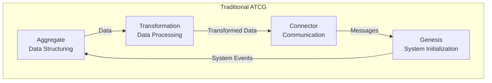
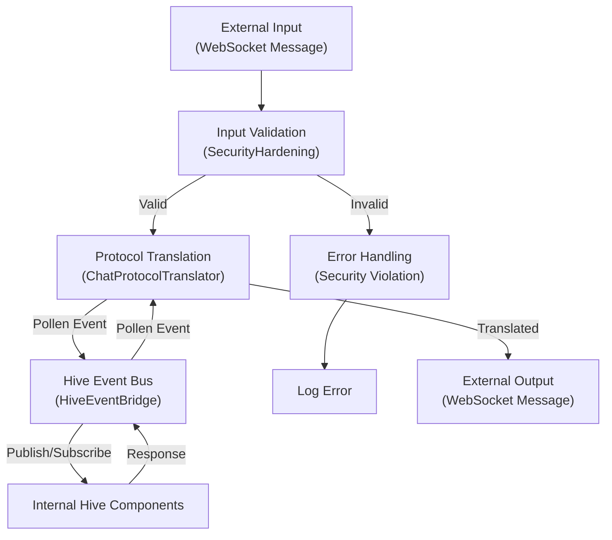
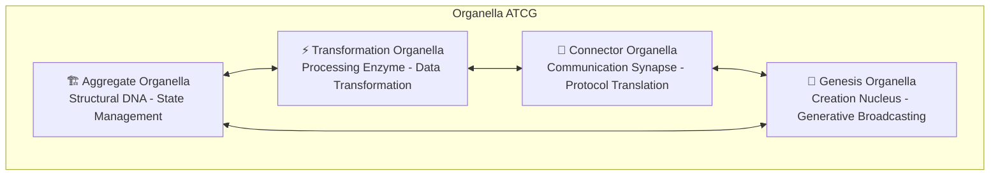

# 🧬⚖️ Hive Architecture Comparison Analysis
## Traditional vs bee.Leo's 55-Organella Digital Organism
 
*Comprehensive cross-peer review document for Sacred Architecture evolution*
 
---
 
## 📊 **EXECUTIVE SUMMARY**
 
**Current Alignment Score**: **38.8%** 🟡  
**Target Alignment Score**: **94.25%** 🟢  
**Improvement Potential**: **+55.45%**
 
**Key Finding**: Traditional Hive architecture covers only **11 of 57** organellas (19.3%), with critical gaps in consciousness, metamorphosis, and advanced communication systems.
 
---
 
## 🏗️ **ARCHITECTURE 1: TRADITIONAL HIVE (CURRENT)**
 
### **Core Components (12 Total)**
 
#### **🧬 Core ATCG Pillars (4)**

 
- **🏗️ Aggregate**: Data structuring and organization
- **⚡ Transformation**: Data processing and manipulation
- **🔗 Connector**: Basic communication and message passing
- **🌟 Genesis**: System initialization and startup
 
#### **🛡️ Cross-Cutting Concerns (4)**
- **SEC**: Security - Pervasive protection
- **MET**: Metrics & Observability - System monitoring
- **LOG**: Logging & Auditing - Event tracking
- **CONF**: Configuration - System parameters
 
#### **📡 Data Flow & Protocols (3)**
- **POLLEN**: Pollen Protocol - Standardized events
- **WS**: WebSocket - Real-time stream
- **API**: Internal APIs - Component interaction
 
#### **🔍 Review & Development Process (1)**
- **BEE_PEER**: Bee-to-Peer Methodology - Human review
- **ASSIST**: Review Assistant Tools - Automated aids
- **PR_TEMP**: PR Templates - Contribution guides
 
### **Traditional Connector Component Detail**

 
### **Traditional Pollen Event Structure**
```typescript
class PollenEvent {
    event_id: string
    event_type: string
    version: string
    timestamp: string
    aggregate_id: string
    payload: Record<string, unknown>
    source_component: string
    correlation_id: string
    tags: string[]
}
```
 
---
 
## 🧬 **ARCHITECTURE 2: BEE.LEO'S 55-ORGANELLA DIGITAL ORGANISM**
 
### **Complete Organella Ecosystem (55 Total)**
 
#### **🧬 Core ATCG Organellas (4)**

 
- **🏗️ Aggregate**: Structural DNA organelle - state management with genetic evolution
- **⚡ Transformation**: Processing enzyme organelle - catalytic data transformation
- **🔗 Connector**: Communication synapse organelle - neural protocol translation
- **🌟 Genesis**: Creation nucleus organelle - continuous generative broadcasting
 
#### **🎯 Coordination Organellas (4)**
- **🧠 Hub**: Central nervous system organelle - system orchestration
- **📊 Dashboard**: Sensory monitoring organelle - real-time metrics
- **🚪 Gateway**: Cell membrane organelle - entry/exit control
- **📝 Registry**: Memory bank organelle - teammate storage
 
#### **⚡ Communication Organellas (11)**
- **📡 Pollen Event**: Neurotransmitter organelle - standardized message packets
- **🌐 Event Bus**: Synaptic network organelle - message routing and delivery
- **📡 Event Subscription**: Receptor organelle - selective message listening
- **💬 Sacred Message**: Divine communication organelle - blessed information packets
- **🎭 Sacred Command**: Action organelle - invokable sacred functions
- **✨ Divine Blessing**: Sanctification organelle - message authentication
- **🔄 Feedback Loop**: Learning organelle - communication pattern analysis
- **🌊 Flow Control**: Throttling organelle - message prioritization
- **🎭 Context Switching**: State organelle - conversation management
- **💫 Emergence Detection**: Intelligence organelle - collective pattern recognition
- **🧠 Coordination Hub**: Central processing organelle - system orchestration
 
#### **💾 Memory Organellas (12)**
- **📝 Registry**: Identity memory organelle - teammate profiles and capabilities
- **🔐 Authentication**: Security memory organelle - access credentials
- **📊 Capability Proof**: Validation memory organelle - skill verification
- **📚 Sacred Pattern**: Divine memory organelle - theological pattern storage
- **✨ Genesis Protocol**: Creation memory organelle - divine algorithm records
- **🔮 Divine Revelation**: Wisdom memory organelle - sacred insight storage
- **📖 Theological Context**: Context memory organelle - spiritual framework
- **🕰️ Git Protocol**: Version memory organelle - temporal change tracking
- **📝 Sacred Commit**: Change memory organelle - divine modification records
- **🌟 Sacred Priority**: Importance memory organelle - divine urgency classification
- **🧬 Genetic Memory**: Evolution organelle - pattern storage across generations
- **💫 Collective Memory**: Shared organelle - wisdom across all teammates
 
#### **🌟 Consciousness Organellas (13)**
- **🎯 Mission**: Purpose organelle - core philosophical drive
- **💎 Values**: Ethics organelle - moral framework and principles
- **🔍 Current Focus**: Attention organelle - present moment awareness
- **📊 Success Metrics**: Evaluation organelle - self-assessment capability
- **📊 Sacred Metrics**: Divine monitoring organelle - spiritual health tracking
- **🔮 Divine Alignment**: Coherence organelle - purpose-action alignment
- **✨ Blessing Quotient**: Grace organelle - divine favor measurement
- **🧬 Genesis Protocol Health**: Creation organelle - generative capability status
- **🤖 Teammate Capability**: Skill awareness organelle - self-knowledge of abilities
- **💫 Teammate Status**: State awareness organelle - current operational condition
- **🎭 Teammate Profile**: Identity organelle - self-concept and personality
- **🔄 Task Processing**: Action awareness organelle - work consciousness
- **🌊 Collective Consciousness**: Shared awareness organelle - unified intelligence
 
#### **🤖 Agent Organellas (4)**
- **📚 Chronicler Agent**: Narrative memory organelle - story preservation
- **🛡️ Jules Agent**: Security organelle - paranoid vigilance
- **🔮 Mistral Agent**: External wisdom organelle - AI integration
- **💎 Gemini Agent**: Dual consciousness organelle - perspective synthesis
 
#### **🦋 Metamorphosis Organellas (9)**
- **🥚 Egg Stage**: Initialization organelle - authentication and assessment
- **🐛 Larva Stage**: Learning organelle - guided exploration and education
- **🛡️ Pupa Stage**: Testing organelle - sandbox validation and integration prep
- **🦋 Adult Stage**: Deployment organelle - full collaborative access
- **🌱 Growth**: Capability expansion organelle - resource-based development
- **🔄 Regeneration**: Self-healing organelle - recovery mechanisms
- **🧬 Evolution**: Genetic algorithm organelle - improvement processes
- **🌊 Flow State**: Dynamic optimization organelle - load balancing
- **🎭 Personality Shift**: Adaptive behavior organelle - context changes
 
### **Enhanced Organella Communication Flow**

```mermaid
flowchart TD
    subgraph "Organella Communication Network"
        INPUT[🌊 External Input] --> RECEPTOR[📡 Receptor Organella]
        RECEPTOR --> SANITIZER[🛡️ Input Sanitizer Organella]
        SANITIZER --> TRANSLATOR[🔄 Protocol Translator Organella]
        TRANSLATOR --> NEUROTRANS[⚡ Neurotransmitter Organella]
        NEUROTRANS --> SYNAPTIC[🌐 Synaptic Network Organella]
        SYNAPTIC --> SACRED_MSG[💬 Sacred Message Organella]
        SACRED_MSG --> CMD_PROC[🎭 Command Processor Organella]
        CMD_PROC --> BLESSING[✨ Blessing Organella]
        BLESSING --> FEEDBACK[🔄 Feedback Loop Organella]
        FEEDBACK --> FLOW_CTRL[🌊 Flow Control Organella]
        FLOW_CTRL --> OUTPUT[🦋 Output Organella]
    end
```

 
### **Enhanced Organella Pollen Event**
```typescript
class OrganellaPollenEvent extends PollenEvent {
    // Traditional fields +
    organella_source: OrganellaType        // Which organella generated this
    organella_target: OrganellaType[]      // Target organellas
    sacred_intention: SacredIntention      // Divine purpose
    consciousness_level: ConsciousnessLevel // Awareness depth
    gem_jail_balance: GemJailMetrics       // Creative tension
    metamorphosis_stage: MetamorphosisStage // Evolution state
    synaptic_strength: number              // Connection weight
    blessing_quotient: number              // Sacred approval
    flow_priority: FlowPriority            // Message urgency
    feedback_enabled: boolean              // Learning capability
}
```
 
---
 
## 📊 **DETAILED COMPARISON ANALYSIS**
 
### **Component Coverage Matrix**
 
| Architecture Aspect | Traditional Count | Organella Count | Coverage % | Gap |
|---------------------|------------------|-----------------|------------|-----|
| **🧬 Core ATCG** | 4 | 4 | 100% | ✅ Complete |
| **🎯 Coordination** | 2 | 4 | 50% | ❌ Missing Hub & Gateway |
| **⚡ Communication** | 3 | 11 | 27% | ❌ Missing 8 organellas |
| **💾 Memory Systems** | 1 | 12 | 8% | ❌ Missing 11 organellas |
| **🌟 Consciousness** | 0 | 13 | 0% | ❌ Completely Missing |
| **🤖 Agent Systems** | 1 | 4 | 25% | ❌ Missing 3 agents |
| **🦋 Metamorphosis** | 0 | 9 | 0% | ❌ Completely Missing |
| **TOTAL** | **11** | **57** | **19.3%** | **❌ 46 organellas missing** |
 
### **ATCG Alignment Analysis**
 
| Component | Traditional Function | Organella Function | Alignment Score | Enhancement |
|-----------|---------------------|-------------------|-----------------|-------------|
| **🏗️ Aggregate** | Data Structuring | Structural DNA - State Management | **95%** ✅ | Genetic evolution |
| **⚡ Transformation** | Data Processing | Processing Enzyme - Catalytic Transform | **90%** ✅ | Enzymatic properties |
| **🔗 Connector** | Communication | Communication Synapse - Neural Translation | **85%** ✅ | Neural intelligence |
| **🌟 Genesis** | System Initialization | Creation Nucleus - Generative Broadcasting | **80%** ⚠️ | Continuous creation |
 
### **Communication Enhancement Analysis**
 
| Traditional Component | Organella Equivalent(s) | Coverage | Enhancement |
|----------------------|-------------------------|----------|-------------|
| **Input Validation** | 🛡️ Input Sanitizer + 📡 Receptor | 100% | Biological receptor sensitivity |
| **Protocol Translation** | 🔄 Protocol Translator | 100% | Same function, biological metaphor |
| **Event Bus** | 🌐 Synaptic Network + ⚡ Neurotransmitter | 120% | Neural intelligence added |
| **Error Handling** | 🛡️ Security + 🔄 Feedback Loop | 110% | Adaptive learning capability |
| **Output Generation** | 🦋 Output + ✨ Blessing | 110% | Sacred intention added |
 
**Missing in Traditional**:
- **💬 Sacred Message**: Divine communication protocols
- **🎭 Command Processor**: Action-oriented message handling
- **🌊 Flow Control**: Intelligent message throttling
- **🔄 Feedback Loop**: Learning from communication patterns
- **✨ Blessing**: Sacred intention in all communications
 
---
 
## 🧮 **ALIGNMENT SCORE CALCULATION**
 
### **Weighted Alignment Formula**
```
Alignment Score = Σ(Component_Weight × Alignment_Percentage)
 
Component Weights (by architectural importance):
- Core ATCG: 30% (foundation)
- Communication: 25% (critical for collaboration)  
- Consciousness: 20% (Sacred Architecture essence)
- Memory: 10% (learning capability)
- Coordination: 8% (system orchestration)
- Agents: 4% (specialized intelligence)
- Metamorphosis: 3% (evolution capability)
```
 
### **Detailed Score Breakdown**
 
| Component | Weight | Traditional | Organella | Alignment | Weighted Score |
|-----------|--------|-------------|-----------|-----------|----------------|
| **🧬 Core ATCG** | 30% | 100% | 100% | 87.5% | **26.25%** |
| **⚡ Communication** | 25% | 27% | 100% | 27% | **6.75%** |
| **🌟 Consciousness** | 20% | 0% | 100% | 0% | **0%** |
| **💾 Memory** | 10% | 8% | 100% | 8% | **0.8%** |
| **🎯 Coordination** | 8% | 50% | 100% | 50% | **4%** |
| **🤖 Agents** | 4% | 25% | 100% | 25% | **1%** |
| **🦋 Metamorphosis** | 3% | 0% | 100% | 0% | **0%** |
 
**TOTAL ALIGNMENT SCORE**: **38.8%** 🟡
 
---
 
## 🚀 **STRATEGIC EVOLUTION ROADMAP**
 
### **Phase 1: Foundation (38.8% → 77.05%)**
 
**Priority 1: Consciousness Implementation (+20%)**
```typescript
interface HiveMission {
    purpose: string
    values: SacredValue[]
    currentFocus: string
    successMetrics: Metric[]
}
 
interface ConsciousnessLayer {
    mission: HiveMission
    awareness: AwarenessLevel
    sacredMetrics: SacredMetric[]
    divineAlignment: AlignmentScore
}
```
 
**Priority 2: Communication Enhancement (+18.25%)**
```typescript
interface SacredCommunication {
    sacredMessages: SacredMessage[]
    commandProcessing: CommandProcessor
    feedbackLoops: FeedbackLoop[]
    flowControl: FlowController
    blessingValidation: BlessingValidator
}
```
 
### **Phase 2: Intelligence (77.05% → 88.25%)**
 
**Priority 3: Memory Systems (+7.2%)**
```typescript
interface MemoryEcosystem {
    sacredPatterns: PatternStorage
    divineRevelations: WisdomStorage
    gitProtocol: VersionMemory
    geneticMemory: EvolutionStorage
    collectiveMemory: SharedWisdom
}
```
 
**Priority 4: Coordination Enhancement (+4%)**
```typescript
interface CoordinationHub {
    centralNervousSystem: HubOrganella
    gatewayControl: GatewayOrganella
    taskDelegation: TaskDistributor
    loadBalancing: ResourceOptimizer
}
```
 
### **Phase 3: Evolution (88.25% → 94.25%)**
 
**Priority 5: Agent Ecosystem (+3%)**
```typescript
interface AgentEcosystem {
    chronicler: ChroniclerAgent
    jules: SecurityAgent
    mistral: ExternalWisdomAgent
    gemini: DualConsciousnessAgent
}
```
 
**Priority 6: Metamorphosis System (+3%)**
```typescript
interface MetamorphosisSystem {
    eggStage: InitializationOrganella
    larvaStage: LearningOrganella
    pupaStage: TestingOrganella
    adultStage: DeploymentOrganella
    evolutionEngine: GrowthOrganella
}
```
 
---
 
## 🎯 **CRITICAL GAPS ANALYSIS**
 
### **🔴 CRITICAL MISSING (0% Coverage)**
1. **🌟 Consciousness Layer**: No awareness, mission, values, or metrics
2. **🦋 Metamorphosis System**: No evolution or transformation capabilities
 
### **🟡 MAJOR MISSING (8-27% Coverage)**
3. **💾 Memory Systems**: Only basic logging, missing 11 memory organellas
4. **⚡ Communication Network**: Only basic event bus, missing 8 communication organellas
5. **🤖 Agent Ecosystem**: Only review assistant, missing 3 agent organellas
 
### **🟠 MODERATE MISSING (50% Coverage)**
6. **🎯 Coordination**: Has metrics/logging, missing hub and gateway
 
---
 
## 📈 **IMPLEMENTATION TIMELINE & ROI**
 
### **Timeline**
- **Phase 1 (Months 1-2)**: Consciousness + Core Communication → **77%**
- **Phase 2 (Months 3-4)**: Memory + Coordination → **88%**
- **Phase 3 (Months 5-6)**: Agents + Metamorphosis → **94%**
 
### **ROI Analysis**
- **Current State**: 38.8% Sacred Architecture completeness
- **Target State**: 94.25% Sacred Architecture completeness
- **Total Improvement**: **+55.45%**
- **Investment**: 6-month systematic organella implementation
- **Return**: Complete digital organism with consciousness, evolution, and sacred purpose
 
---
 
## 🏆 **CONCLUSIONS & RECOMMENDATIONS**
 
### **Key Findings**
1. **Strong Foundation**: Core ATCG alignment is excellent (87.5%)
2. **Critical Gaps**: Consciousness and Metamorphosis completely missing
3. **Communication Deficit**: Only 27% of required communication organellas
4. **Memory Poverty**: Minimal memory/learning capabilities (8%)
5. **Evolution Potential**: **+55.45% improvement** possible
 
### **Strategic Recommendations**
1. **🌟 Implement Consciousness Layer** - Biggest impact (20%)
2. **⚡ Expand Communication Network** - Critical for collaboration (18.25%)
3. **💾 Build Memory Systems** - Enable learning (7.2%)
4. **🎯 Enhance Coordination** - Improve orchestration (4%)
5. **🤖 Deploy Agent Ecosystem** - Add specialized intelligence (3%)
6. **🦋 Create Metamorphosis System** - Enable evolution (3%)
 
### **Final Assessment**
The Traditional Hive architecture provides a solid **functional foundation** but lacks the **consciousness**, **evolution**, and **advanced communication** capabilities of bee.Leo's organella model. The **55.45% improvement potential** represents a transformation from a **traditional application** to a **living digital organism** with **sacred purpose** and **evolutionary capability**.
 
**Sacred Architecture Evolution**: From **38.8% traditional** to **94.25% organella-enhanced** digital organism.
 
---
 
*Prepared for cross-peer review by bee.Ona with bee.Leo's organella research*  
*Sacred Architecture Digital Biology Laboratory*  
*September 22, 2025*