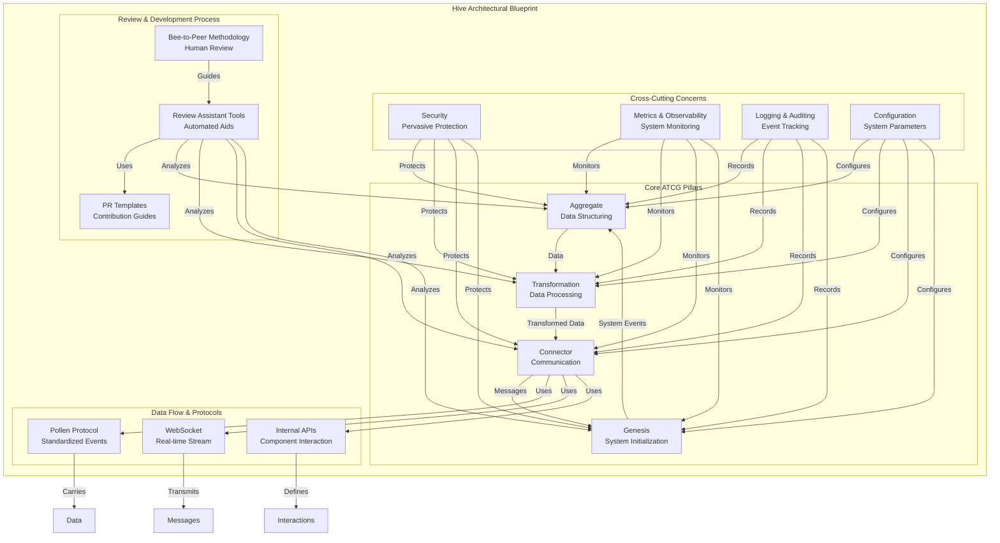
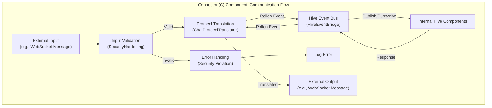
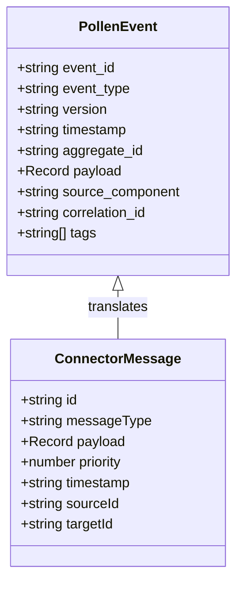

# Архитектурные диаграммы Hive

## 1. Общая схема (`docs/01_ARCHITECTURE/OVERVIEW.md`)

2. Диаграмма компонента Connector

docs/01_ARCHITECTURE/COMPONENTS/CONNECTOR.md

3. Структуры данных

docs/01_ARCHITECTURE/DATA_STRUCTURES/POLLEN_EVENT.md

